# Visual Studio Code integration with SQL database

In this section of the lab, we will open a Fabric database directly in **Visual Studio Code**  using the **Fabric extension**. This demonstrates how Fabric provides a consistent and integrated experience across familiar SQL tools.

> **Note:** The MSSQL extension for Visual Studio Code supports connecting to SQL database in Microsoft Fabric. The Connection dialog includes a Fabric connectivity option that lets you sign in with Microsoft Entra ID. You can browse Fabric workspaces in a tree view, search across workspaces, and connect to SQL databases or endpoints without manually configuring connection strings. The extension supports persistent sign-in, tenant switching, and a seamless Open in MSSQL flow from the Fabric extension.

---
## Section 1 Connect to SQL database
### Task 1.1 
   Please install **mssql** extension from extension marketplace.

   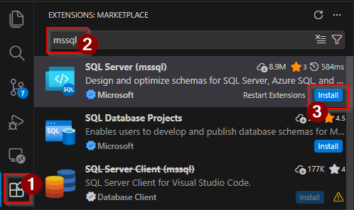

### Task 1.2
1. Create a new folder in your working directory e.g. c:\User Name\FabconProject
2. Open VS Code, Select File -> Open Folder -> select the new folder you created.

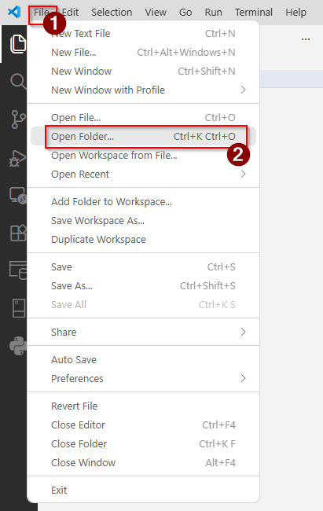

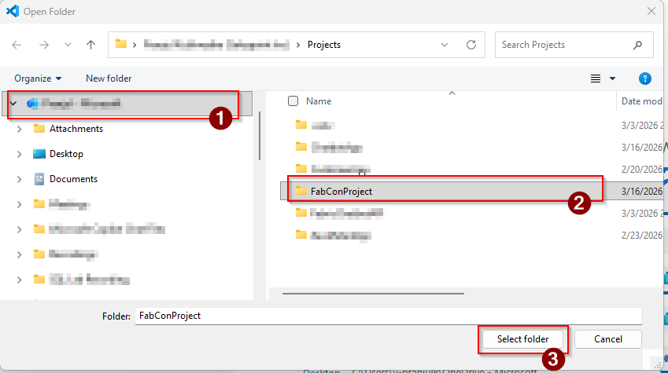

3. In the VS Code, Open **SQL Server extension** and click on **+ Add Connection**.

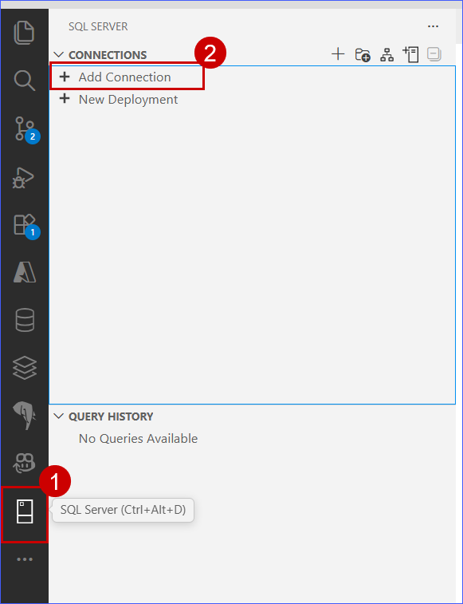

4. Click **Browse Fabric** and select **Sign into fabric**.

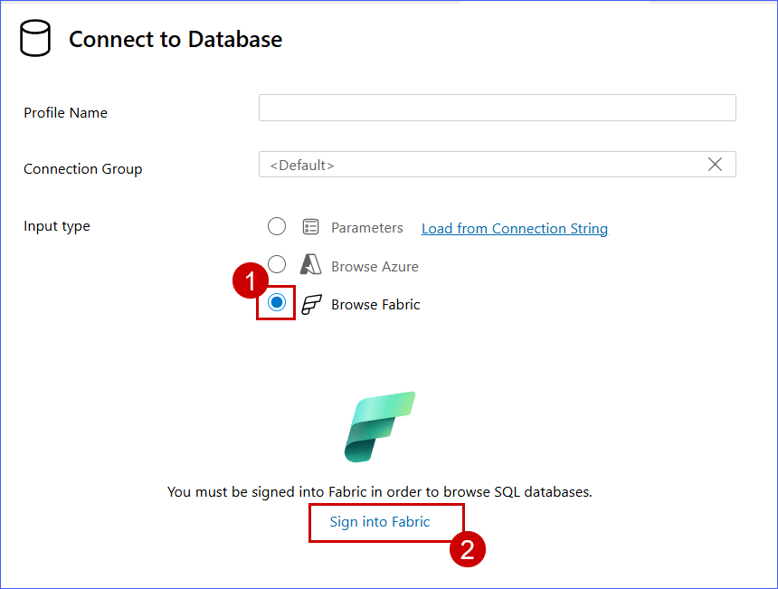

5. Click **Allow** to authenticate.

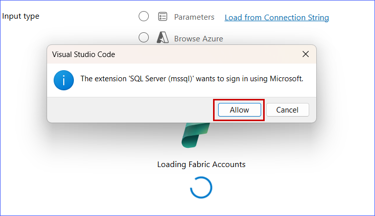

6. **Sign in** with the Entra Credentials provided with the workshop.

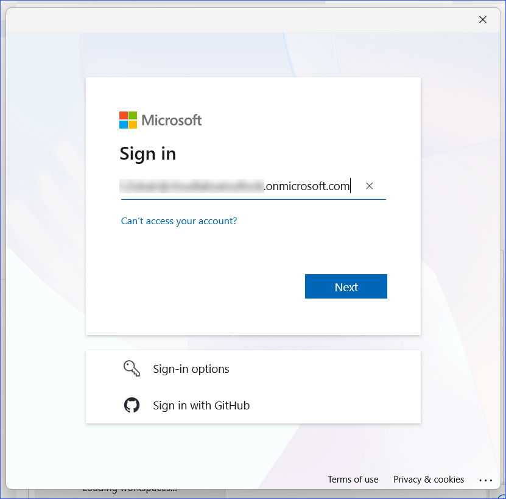

7. Click **Allow** for extension to list workspaces.

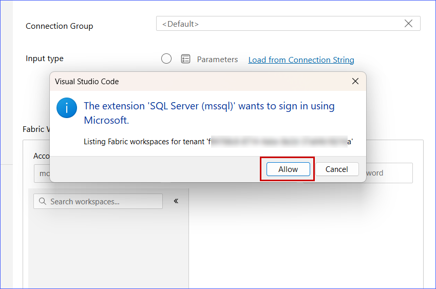

   > **Note:** You need to sign in again to list workspaces.

8. Select your **workspace**, **database** and click on **Sign in**.

 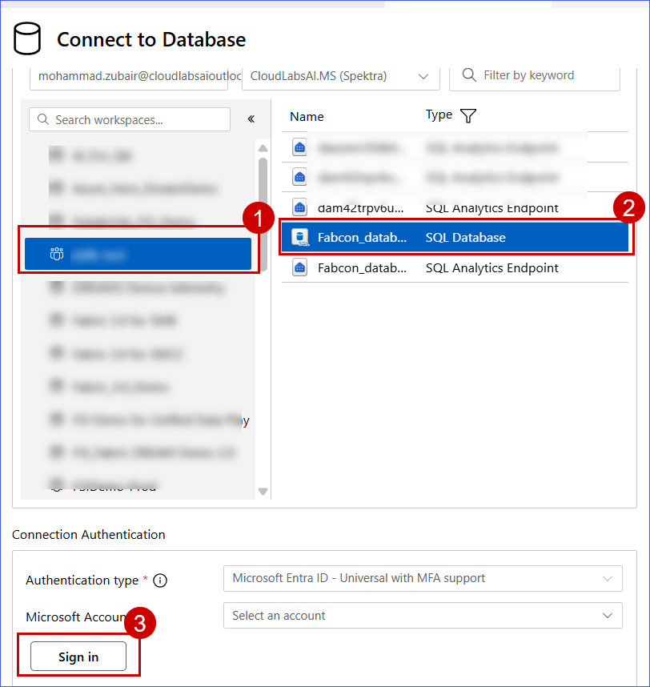

9. After signing in, click **Connect** to establish the connection to your SQL database.

 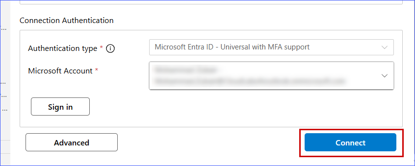

10. In the left panel, verify that the database is connected. Click **Group by Schema** to view all schemas.

  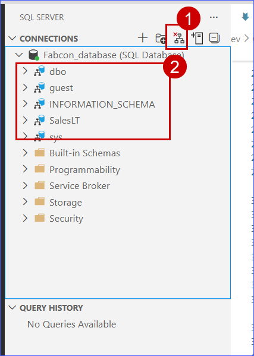

## Section 2: Database development

### Task 2.1 - Create new schema and database objects
1. Right-click on the database and select **New Query**.

   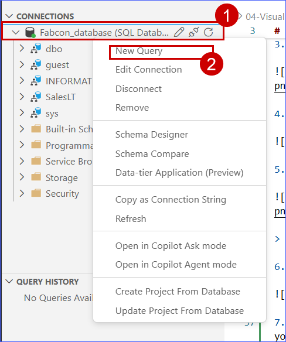

2. Paste the following query into the editor and click **Execute Query**. Refresh the database to see the supply chain schema created.

   ```SQL
   CREATE SCHEMA SupplyChain;
   GO
   ```

   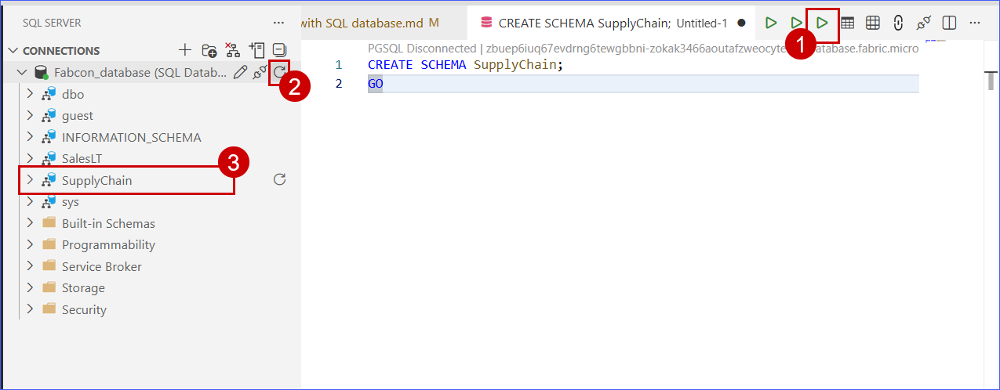

3. Paste the following query into the editor, **select** and click **Execute Query** to create tables.

```SQL
/* ============================================================
   SUPPLY CHAIN EXTENSION SCRIPT – FABRIC SQL WORKSHOP
   Creates remaining tables + inserts demo data
   ============================================================ */

CREATE TABLE SupplyChain.Warehouse (
  ProductID INT PRIMARY KEY  -- ProductID to link to Products and Sales tables
, ComponentID INT -- Component Identifier, for this tutorial we assume one per product, would normalize into more tables
, SupplierID INT -- Supplier Identifier, would normalize into more tables
, SupplierLocationID INT -- Supplier Location Identifier, would normalize into more tables
, QuantityOnHand INT); -- Current amount of components in warehouse
GO

/* Insert data from the Products table into the Warehouse table. Generate other data for this tutorial */
INSERT INTO SupplyChain.Warehouse (ProductID, ComponentID, SupplierID, SupplierLocationID, QuantityOnHand)
SELECT p.ProductID,
    ABS(CHECKSUM(NEWID())) % 10 + 1 AS ComponentID,
    ABS(CHECKSUM(NEWID())) % 10 + 1 AS SupplierID,
    ABS(CHECKSUM(NEWID())) % 10 + 1 AS SupplierLocationID,
    ABS(CHECKSUM(NEWID())) % 100 + 1 AS QuantityOnHand
FROM [SalesLT].[Product] AS p;
GO


---------------------------------------------------------------
-- 1️⃣ Create Suppliers
---------------------------------------------------------------
IF OBJECT_ID('SupplyChain.Suppliers') IS NULL
BEGIN
    CREATE TABLE SupplyChain.Suppliers (
        SupplierID INT IDENTITY(1,1) PRIMARY KEY,
        SupplierName NVARCHAR(100) NOT NULL,
        ContactName NVARCHAR(100),
        Phone NVARCHAR(25),
        Email NVARCHAR(100),
        SupplierLocationID INT,
        IsActive BIT NOT NULL DEFAULT 1,
        CreatedDate DATETIME2 NOT NULL DEFAULT SYSDATETIME()
    );
END
GO

---------------------------------------------------------------
-- 2️⃣ Create PurchaseOrders
---------------------------------------------------------------
IF OBJECT_ID('SupplyChain.PurchaseOrders') IS NULL
BEGIN
    CREATE TABLE SupplyChain.PurchaseOrders (
        PurchaseOrderID INT IDENTITY(1,1) PRIMARY KEY,
        SupplierID INT NOT NULL,
        OrderDate DATETIME2 NOT NULL DEFAULT SYSDATETIME(),
        ExpectedDeliveryDate DATETIME2,
        Status NVARCHAR(50) NOT NULL DEFAULT 'Open',
        TotalAmount DECIMAL(18,2),

        CONSTRAINT FK_PurchaseOrders_Suppliers
            FOREIGN KEY (SupplierID)
            REFERENCES SupplyChain.Suppliers(SupplierID)
    );
END
GO

---------------------------------------------------------------
-- 3️⃣ Create PurchaseOrderLines
---------------------------------------------------------------
IF OBJECT_ID('SupplyChain.PurchaseOrderLines') IS NULL
BEGIN
    CREATE TABLE SupplyChain.PurchaseOrderLines (
        PurchaseOrderLineID INT IDENTITY(1,1) PRIMARY KEY,
        PurchaseOrderID INT NOT NULL,
        ProductID INT NOT NULL,
        OrderedQuantity INT NOT NULL,
        UnitCost DECIMAL(18,2) NOT NULL,
        LineTotal AS (OrderedQuantity * UnitCost) PERSISTED,

        CONSTRAINT FK_POL_PurchaseOrders
            FOREIGN KEY (PurchaseOrderID)
            REFERENCES SupplyChain.PurchaseOrders(PurchaseOrderID),

        CONSTRAINT FK_POL_Product
            FOREIGN KEY (ProductID)
            REFERENCES SalesLT.Product(ProductID)
    );
END
GO

---------------------------------------------------------------
-- 4️⃣ Create InventoryTransactions
---------------------------------------------------------------
IF OBJECT_ID('SupplyChain.InventoryTransactions') IS NULL
BEGIN
    CREATE TABLE SupplyChain.InventoryTransactions (
        InventoryTransactionID INT IDENTITY(1,1) PRIMARY KEY,
        ProductID INT NOT NULL,
        WarehouseID INT NULL,
        TransactionType NVARCHAR(50) NOT NULL,
        Quantity INT NOT NULL,
        TransactionDate DATETIME2 NOT NULL DEFAULT SYSDATETIME(),
        ReferenceID INT NULL,

        CONSTRAINT FK_Inventory_Product
            FOREIGN KEY (ProductID)
            REFERENCES SalesLT.Product(ProductID)
    );
END
GO

---------------------------------------------------------------
-- 5️⃣ Create SupplierPerformance
---------------------------------------------------------------
IF OBJECT_ID('SupplyChain.SupplierPerformance') IS NULL
BEGIN
    CREATE TABLE SupplyChain.SupplierPerformance (
        SupplierPerformanceID INT IDENTITY(1,1) PRIMARY KEY,
        SupplierID INT NOT NULL,
        EvaluationDate DATETIME2 NOT NULL DEFAULT SYSDATETIME(),
        OnTimeDeliveryRate DECIMAL(5,2),
        QualityScore DECIMAL(5,2),
        AverageLeadTimeDays INT,
        RiskScore DECIMAL(5,2),
        AIInsight NVARCHAR(500),

        CONSTRAINT FK_SupplierPerformance_Supplier
            FOREIGN KEY (SupplierID)
            REFERENCES SupplyChain.Suppliers(SupplierID)
    );
END
GO

/* ============================================================
   INSERT DEMO DATA
   ============================================================ */

---------------------------------------------------------------
-- Insert Suppliers (10 demo suppliers)
---------------------------------------------------------------
IF NOT EXISTS (SELECT 1 FROM SupplyChain.Suppliers)
BEGIN
    DECLARE @i INT = 1;
    WHILE @i <= 10
    BEGIN
        INSERT INTO SupplyChain.Suppliers
        (SupplierName, ContactName, Phone, Email, SupplierLocationID)
        VALUES
        (
            CONCAT('Supplier ', @i),
            CONCAT('Contact ', @i),
            CONCAT('+1-800-', 1000 + @i),
            CONCAT('supplier', @i, '@demo.com'),
            ABS(CHECKSUM(NEWID())) % 10 + 1
        );
        SET @i = @i + 1;
    END
END
GO

---------------------------------------------------------------
-- Insert Purchase Orders
---------------------------------------------------------------
IF NOT EXISTS (SELECT 1 FROM SupplyChain.PurchaseOrders)
BEGIN
    INSERT INTO SupplyChain.PurchaseOrders
    (SupplierID, OrderDate, ExpectedDeliveryDate, Status, TotalAmount)
    SELECT 
        SupplierID,
        DATEADD(DAY, -ABS(CHECKSUM(NEWID())) % 30, SYSDATETIME()),
        DATEADD(DAY, ABS(CHECKSUM(NEWID())) % 15, SYSDATETIME()),
        'Open',
        ABS(CHECKSUM(NEWID())) % 5000 + 500
    FROM SupplyChain.Suppliers;
END
GO

---------------------------------------------------------------
-- Insert Purchase Order Lines
---------------------------------------------------------------
IF NOT EXISTS (SELECT 1 FROM SupplyChain.PurchaseOrderLines)
BEGIN
    INSERT INTO SupplyChain.PurchaseOrderLines
    (PurchaseOrderID, ProductID, OrderedQuantity, UnitCost)
    SELECT 
        po.PurchaseOrderID,
        p.ProductID,
        ABS(CHECKSUM(NEWID())) % 50 + 1,
        p.StandardCost
    FROM SupplyChain.PurchaseOrders po
    CROSS JOIN (
        SELECT TOP 5 ProductID, StandardCost
        FROM SalesLT.Product
        ORDER BY NEWID()
    ) p;
END
GO

---------------------------------------------------------------
-- Insert Inventory Transactions
---------------------------------------------------------------
IF NOT EXISTS (SELECT 1 FROM SupplyChain.InventoryTransactions)
BEGIN
    INSERT INTO SupplyChain.InventoryTransactions
    (ProductID, WarehouseID, TransactionType, Quantity, TransactionDate)
    SELECT 
        ProductID,
        1,
        CASE WHEN ABS(CHECKSUM(NEWID())) % 2 = 0 THEN 'IN' ELSE 'OUT' END,
        ABS(CHECKSUM(NEWID())) % 100 + 1,
        DATEADD(DAY, -ABS(CHECKSUM(NEWID())) % 60, SYSDATETIME())
    FROM SalesLT.Product;
END
GO

---------------------------------------------------------------
-- Insert Supplier Performance
---------------------------------------------------------------
IF NOT EXISTS (SELECT 1 FROM SupplyChain.SupplierPerformance)
BEGIN
    INSERT INTO SupplyChain.SupplierPerformance
    (SupplierID, OnTimeDeliveryRate, QualityScore, AverageLeadTimeDays, RiskScore, AIInsight)
    SELECT 
        SupplierID,
        CAST(ABS(CHECKSUM(NEWID())) % 40 + 60 AS DECIMAL(5,2)),
        CAST(ABS(CHECKSUM(NEWID())) % 40 + 60 AS DECIMAL(5,2)),
        ABS(CHECKSUM(NEWID())) % 20 + 1,
        CAST(ABS(CHECKSUM(NEWID())) % 50 AS DECIMAL(5,2)),
        'AI Insight: Stable performance with moderate variability.'
    FROM SupplyChain.Suppliers;
END
GO

/* ============================================================
   DONE – SupplyChain Schema Fully Populated
   ============================================================ */

```
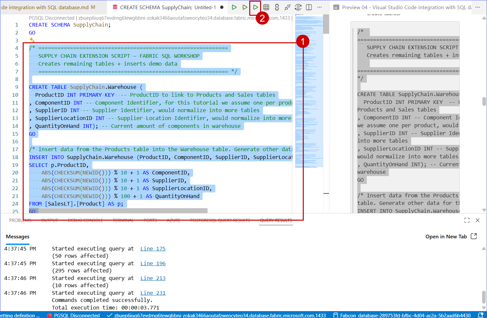
### Task 2.2 - Refresh Schema

1. After executing the queries to create the Supply Chain schema and its associated tables, you need to refresh the database in Visual Studio Code to see the newly created tables. Right-click on the database in the left panel and select **Refresh** to update the view.

   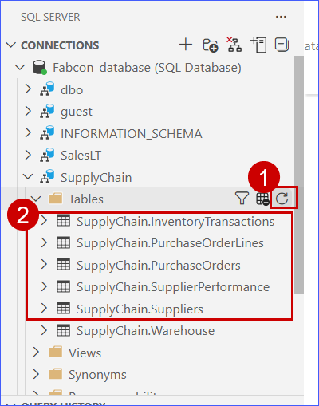

## Section 3 Using Github Copilot
   After setting up the supply chain tables and populating them with data, the next step is to make it easier for users to analyze and extract meaningful insights from the data. In real-world scenarios, raw transactional tables are often complex and not optimized for quick analysis.
   To simplify data exploration and enable faster insights, we will create analytical views on top of the SupplyChain tables. These views combine and summarize relevant information such as supplier performance, purchase activity, and inventory levels.
### Task 3.1
1. Click the Copilot Chat icon in the top right corner of VS Code.  

   

2. In the Copilot Chat panel, type the following prompt and Press Enter to let Copilot generate the SQL.

```
-- Create a SQL view named SupplyChain.vw_SupplierRiskInsights
-- The view should join Suppliers and SupplierPerformance tables
-- Include SupplierName, OnTimeDeliveryRate, QualityScore, RiskScore
-- Add a computed column RiskCategory:
--   High Risk if RiskScore >= 40
--   Medium Risk if RiskScore between 20 and 39
--   Low Risk otherwise
-- Ensure proper joins using SupplierID
```

3. Insert the SQL code, click the Run (▶) button in VS Code to execute the script against your Fabric SQL Database.

   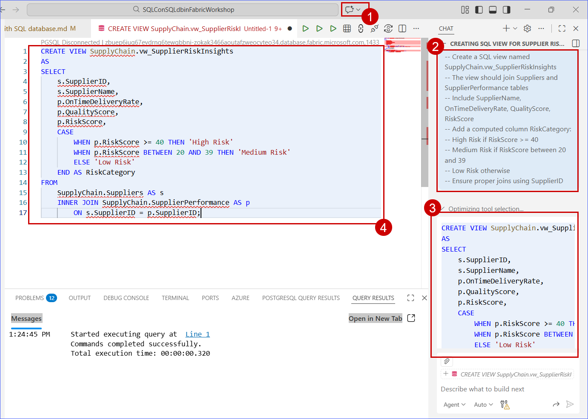

> **Note:** If the generated query does not appear directly in the Copilot chat as shown in the lab guide, select the created view provided in the Copilot chat and click the Run button to execute the query.
> 
> 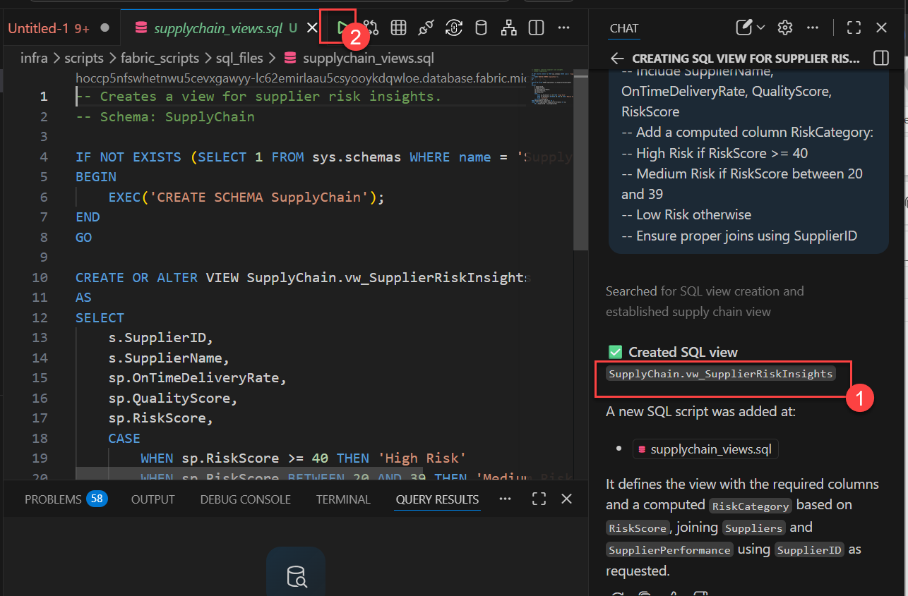

4. Run the following query to test the view:

   ```SQL
   SELECT * FROM SupplyChain.vw_SupplierRiskInsights;
   
   ```

   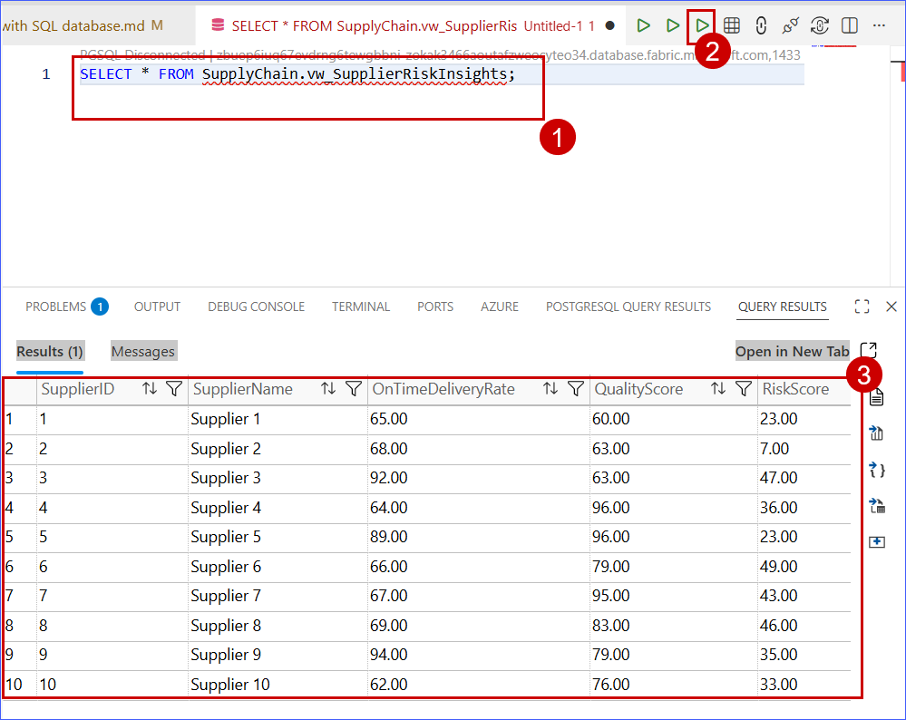

### Task 3.2

1.
```
-- Create a SQL view named SupplyChain.vw_SupplyRiskAnalysis
-- The view should join Warehouse, Suppliers, and SupplierPerformance
-- Include ProductID, SupplierName, QuantityOnHand, RiskScore
-- Add a computed column SupplyRiskLevel:
--   High Supply Risk if QuantityOnHand < 20 AND RiskScore > 30
--   Potential Risk if QuantityOnHand < 50
--   Stable otherwise
-- Use proper joins based on SupplierID
```

2. Navigate back to your SQL database in Fabric to verify that the changes are reflected. **Expand** the **Supply Chain** schema and select any table to preview the data.

   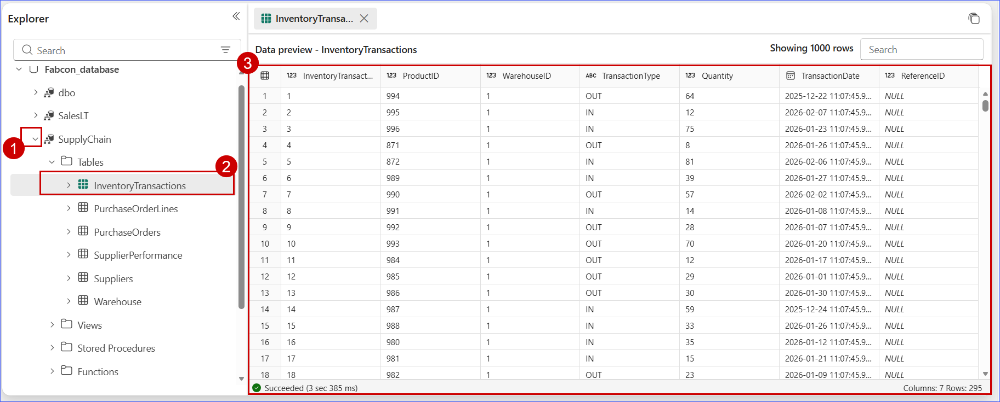


## What's next
Congratulations! You have learnt how to leverage **Visual Studio Code with SQL database in Microsoft Fabric** to enhance your **database development** experience. With these skills, you are now better equipped to write and execute SQL queries from VS Code. You are ready to move on to the next exercise: 
[Get your database AI ready using Vector and RAG patterns](../Module%2004%20-%20Get%20your%20database%20AI%20ready%20using%20Vector%20%26%20RAG%20patterns/Prepare%20your%20data%20to%20store%20Vector%20data%20for%20Vector%20search%20to%20enavle%20AI%20application%20development.md) to enable your data for Chabbot application.
