# Build a Chatbot Application with GHCP + VS Code

In this section of the lab, you will build a simple chatbot application using GitHub Copilot Chat (GHCP) and Visual Studio Code. The chatbot uses a Microsoft Fabric GraphQL endpoint backed by a SQL database to dynamically generate responses based on user input. This exercise demonstrates how developers can quickly scaffold a data‑driven application by combining Fabric, GraphQL, and AI‑assisted development workflows.
By the end of this section, you will have a working chatbot UI that accepts a user question, sends it to a Fabric GraphQL endpoint, and displays the response in the application.

## Section 1: Prerequisites
Before starting this section, ensure the following are completed:

1. Python is installed at your machine.
2. A SQL database exists in Fabric and is exposed through a GraphQL API.
3. Visual Studio Code is installed. 
4. GitHub Copilot Chat is enabled in VS Code.

### Task 1.1 **Python Installation**
This exercise requires Python to run the sample application and interact with the Fabric GraphQL endpoint. If Python is not already installed, follow the steps below based on your operating system.

**[`Download Python`](https://www.python.org/downloads/release/python-3143/)**

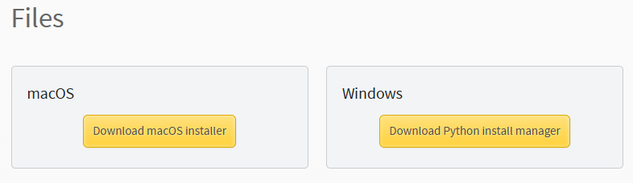

 **Windows**

Python provides separate installers for 64-bit and 32-bit Windows systems.
**[`Download Python for Windows`](https://www.python.org/downloads/windows/)**

**Windows 64-bit:**
Download Python for Windows (64-bit) 

**Windows 32-bit:**
Download Python for Windows (32-bit)

Run the installer.

Ensure Add Python to PATH is selected during installation.

Complete the installation using the default options. 

**macOS**

Python provides a universal installer that supports both Intel and Apple silicon Macs.

Download the macOS installer:
**[`Download Python for macOS`](https://www.python.org/downloads/macos/)**
Open the downloaded .pkg file.
Follow the installation wizard using the default settings.

## Section 2: Application Overview
The chatbot application follows a simple interaction flow:

1. The user enters a question in the chatbot UI under What can I help you with?
2. The user clicks the Ask button.
3. The application sends the question to a Fabric GraphQL endpoint.
4. The response returned by GraphQL is displayed in the UI.


> **Note:** The application is intentionally kept simple and workshop friendly, focusing on integration rather than complex frontend logic.

## Section 2: Building Chatbot application with GHCP + VSCode
### Task 2.1: Copy the GraphQL Endpoint from Fabric

1. Navigate to your Microsoft Fabric workspace.
   > **Note:** The name of your Fabric workspace may be different.
   
   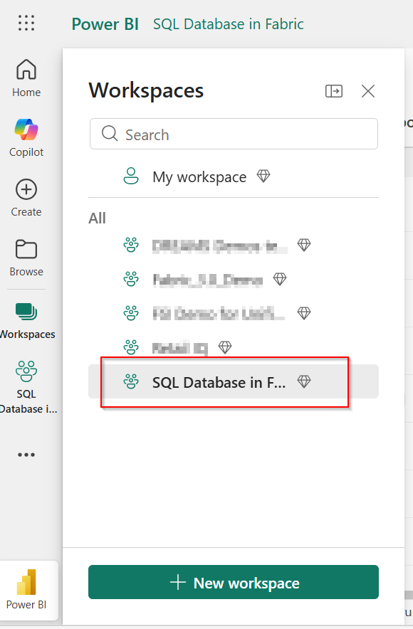
2. Open the GraphQL API associated with your SQL database.

   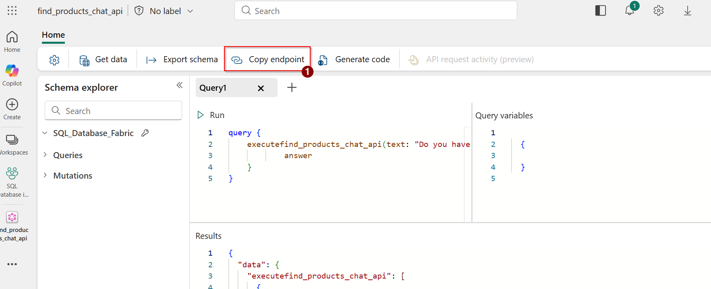
3. Copy the GraphQL endpoint URL.

   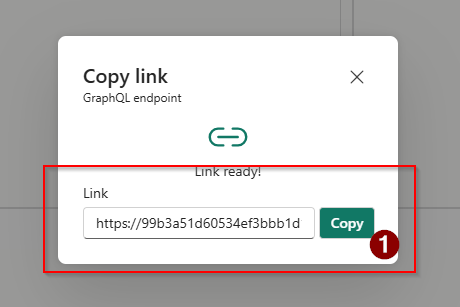
4. Open a notepad file and paste the GraphQL, we will need it later.

You will use this endpoint in the application code generated by GHCP.
> [!TIP]
> Each participant will copy the GraphQL endpoint from their own Fabric workspace. This ensures the chatbot application connects to the correct environment.

### Section 3: Create the Chatbot Project using GHCP
## Task 3.1: In Visual Studio Code open GitHub Copilot Chat.

 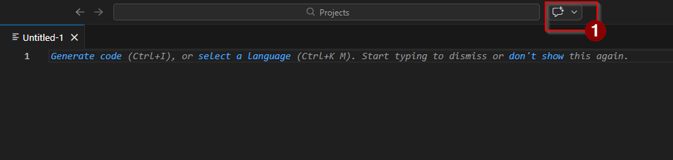

Select the agent mode.

 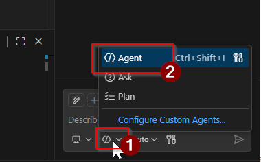

Now, enter the following prompt into the chat window.

 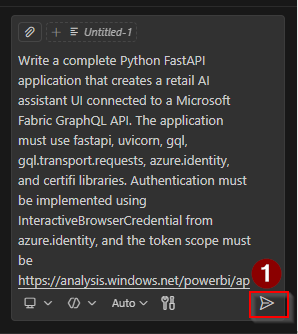

**Prompt**
```
Write a complete Python FastAPI application that creates a retail AI assistant UI connected to a Microsoft Fabric GraphQL API.
The application must use fastapi, uvicorn, gql, gql.transport.requests, azure.identity, and certifi libraries. Authentication must
be implemented using InteractiveBrowserCredential from azure.identity, and the token scope must be https://analysis.windows.net/powerbi/api/.default.
Implement a function called get_token() that retrieves the access token using InteractiveBrowserCredential. Implement another function called
nl_to_graphql(nl_query) that converts a natural language query into the GraphQL format query { executefind_products_chat_api(text: "<user query>")
{ answer } }, ensuring quotes are escaped properly before embedding in the GraphQL string. The application must expose a FastAPI server, serve a
fully styled HTML UI at the root endpoint /, and implement a POST endpoint /query that accepts a natural language query from a form, converts it
into GraphQL, authenticates using the Azure token, and executes the query using gql Client with RequestsHTTPTransport. The transport configuration
 must include the GraphQL endpoint stored in a variable called GRAPHQL_URL, pass the token using the Authorization: Bearer token header, enable
 retries, and verify SSL certificates using certifi.where(). The UI must be recreated exactly with the same layout, gradient background, header
branding (Zava Retail), banner with shopping illustration, assistant section, input field, Ask button, response container titled “Response”,
responsive CSS styling, and JavaScript that submits the form using fetch() and shows “Thinking…” while waiting for the response. The backend
must correctly handle the GraphQL response structure where executefind_products_chat_api may return either a list of objects or a dictionary,
and it must safely extract only the natural language answer field. If the response is a list, extract the answer from the first element;
if it is a dictionary, extract the answer directly. The backend must return only { "answer": "<natural language result>" } instead of the
full JSON GraphQL response. The frontend must display only the natural language answer text in the response panel, not the JSON object. If an
 error occurs, return { "error": "<message>" } and display the error in the UI. The final implementation must be a single Python file containing
 the FastAPI backend, HTML UI, CSS styling, JavaScript logic, authentication, and GraphQL execution, and the application must run using
uvicorn.run(app, host="127.0.0.1", port=8000). Ensure the code properly handles the GraphQL response type so that errors like 'list' object
has no attribute 'get' never occur.

```
> [!TIP]
>Click 'Allow'/Keep' everytime it apprears in the GHCP chat.

This will write your code for the frontend of the application.

### Task 3.2: Update the GraphQL Endpoint in the Code

1. Locate the configuration or python file generated by GHCP.
2. Press Ctr + F and search for **'GRAPHQL_URL'**. Find the placeholder GraphQL endpoint variable.
    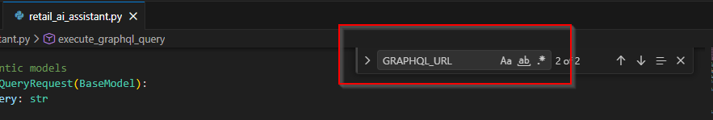
3. Replace it with the GraphQL endpoint you copied from your Fabric workspace in the notepad.
   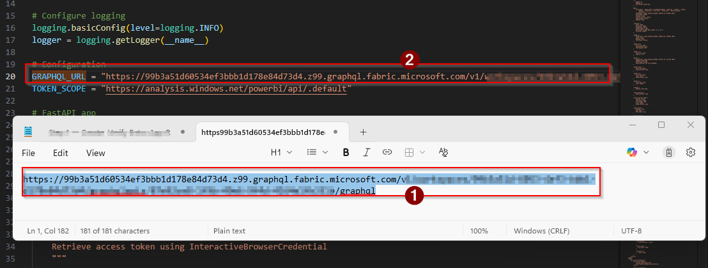

### Task 3.3: Run the Chatbot Application

Use the prompt below, to deploy the application. Follow the instruction from the GHCP.

**Prompt**
```
My app is ready, can you help me to deloy this app on my local machine.
```
> [!TIP]
>Click 'Allow'/'Keep' everytime it apprears in the GHCP chat.
>

 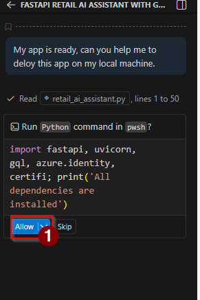
 
Follow the steps in order to deploy the chatbot application on your local machine.
In the end it will prompt you to Open somethinkg like http://xxx:xxx:xxx.

 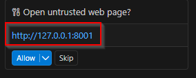

 
> [!TIP]
> If you see an error like “Only one usage of each socket address is normally permitted”
This error indicates that the port is already being used by another process.
>  
> To fix this, change **only the port number** in the `uvicorn.run(app, host="127.0.0.1", port=XXXX)` line to a different value (for example, 8002 or 8010), then rerun the application.
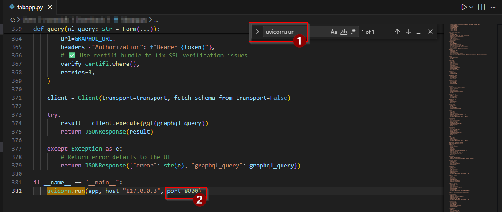

### Task 3.4: Explore your Chatbot

1. Open the application in your browser. (eg: http://xxx:xxx:xxx)

      > **Note:** Since we are using GitHub Copilot to generate the code, the generated code and UI may vary each time. As a result, your application might look slightly different from the one showed below. This is completely expected and absolutely fine.
      
2. Enter a question in the chatbot input field.(You can you a qestion mentioned below) and click 'Ask'.
   ```
   I want to know more about cycling shorts.
   ```
   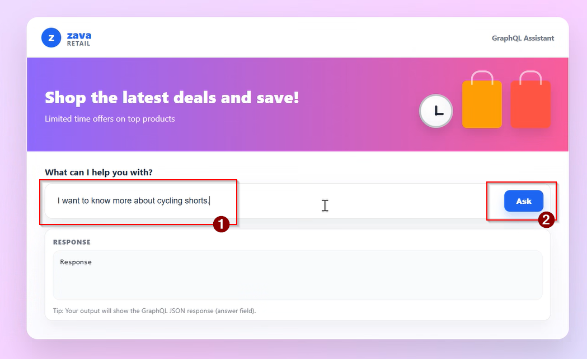
3. For authentication it will redirect you to another page.
4. Select your Microsoft Account for authentication. And return to you application page on browser.
   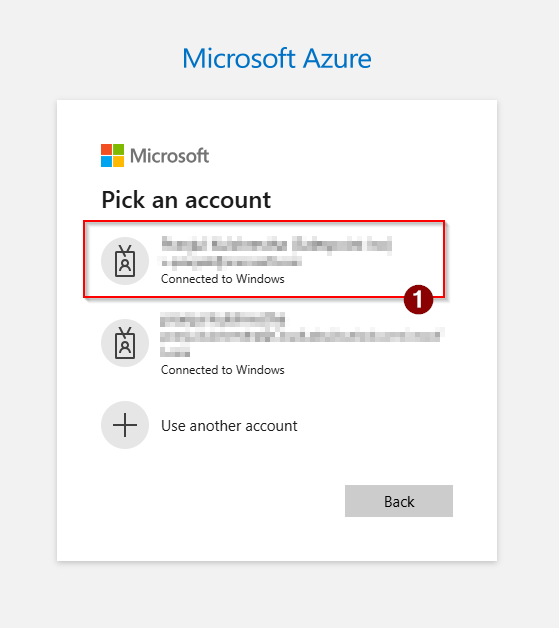 
5. You may see the response now.

    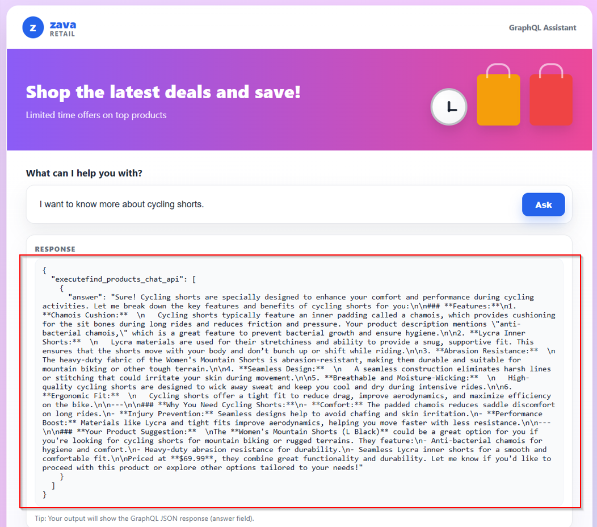
Review the response returned from the Fabric GraphQL endpoint.

    > **Note:** If you ask very generic questions, the assistant may not return accurate results, because responses are generated only from the data available in the Fabric SQL table. Please ask questions that align with what exists in that data.

7. You may also ask questions like:
```
- Tell me about red shirts.
- Do you have any seats for bicycles?
```

You should see the chatbot dynamically return results based on the data and logic exposed through GraphQL.


> **Note:** If, for any reason, the code cannot be generated or executed using GHCP, you may **download** the code below and run it in VS Code
> **[`fabapp.py`](../../artifacts/fabapp.py)**


## What's next
Congratulations! In this exercise, you gained valuable, hands-on experience by building a chatbot application using Visual Studio Code and GitHub Copilot Chat. You successfully connected your application to a SQL database through a GraphQL endpoint, deepening your understanding of integrating data sources. Additionally, you explored how AI-assisted development with tools like Gihub Copilot can significantly accelerate the process of creating robust, data-driven AI applications, making development both faster and more efficient.
In the next module you will learn to [Integrate with Data Agents, Data Visualiztion & Power BI](../Module%2007%20-%20Integrate%20with%20%20Data%20Agents%2C%20Data%20Virtualization%20%26%20Power%20BI/01%20-%20Data%20Agent.md)
