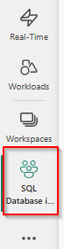
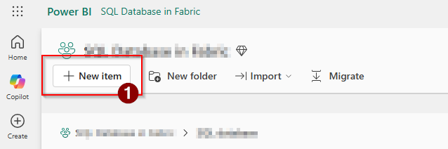
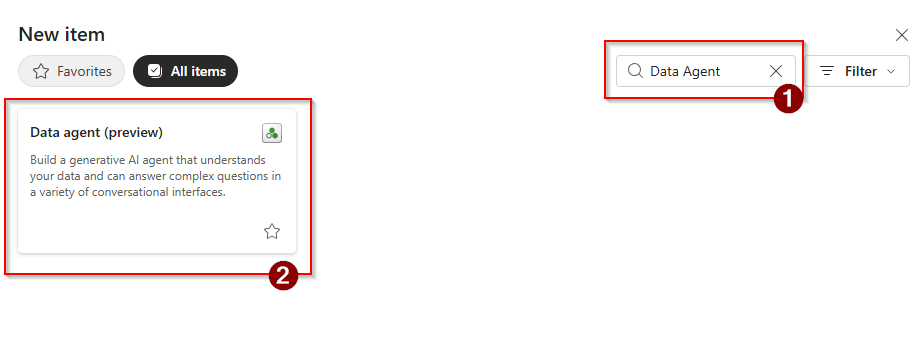
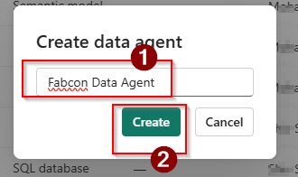
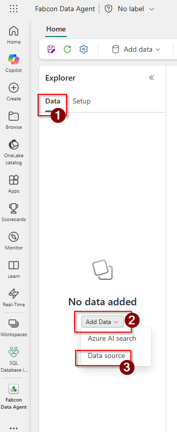
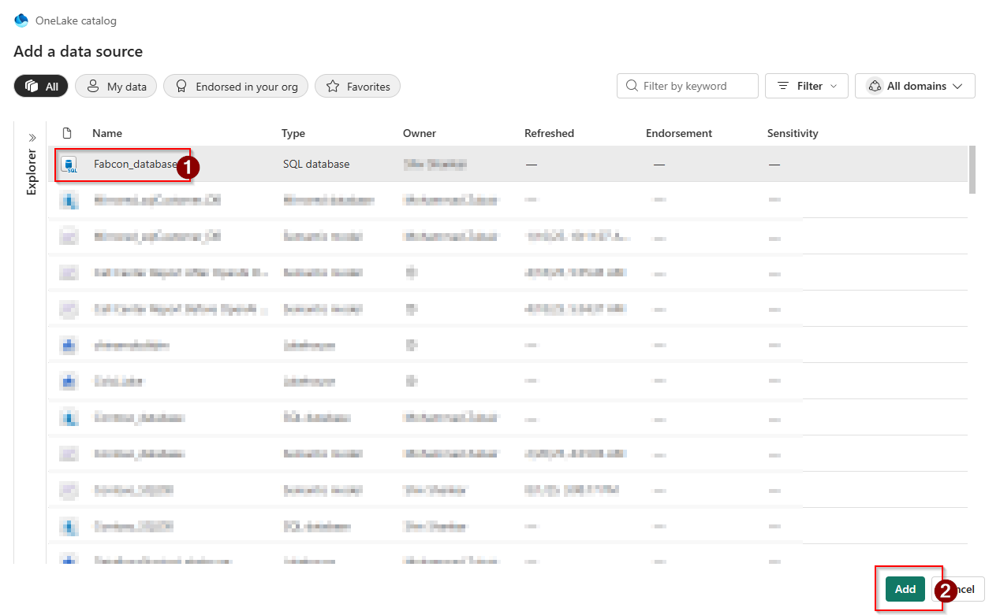
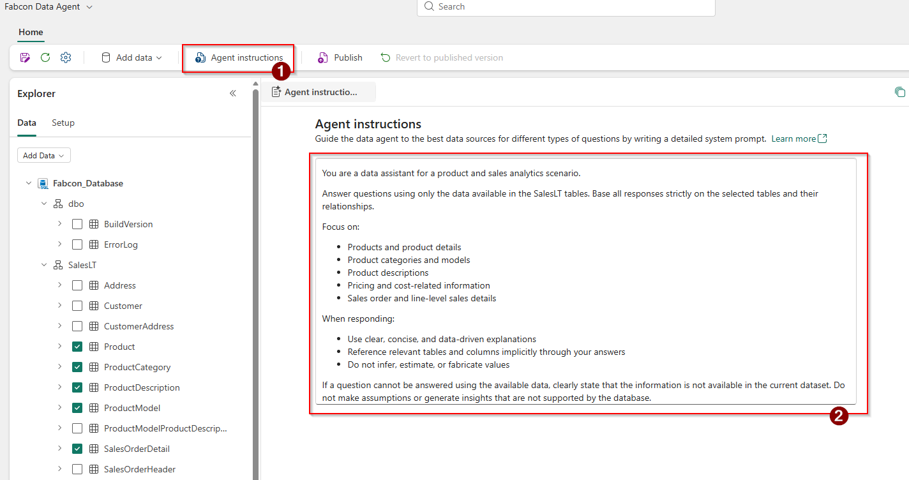
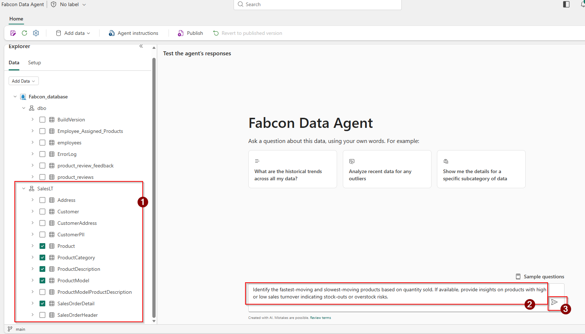
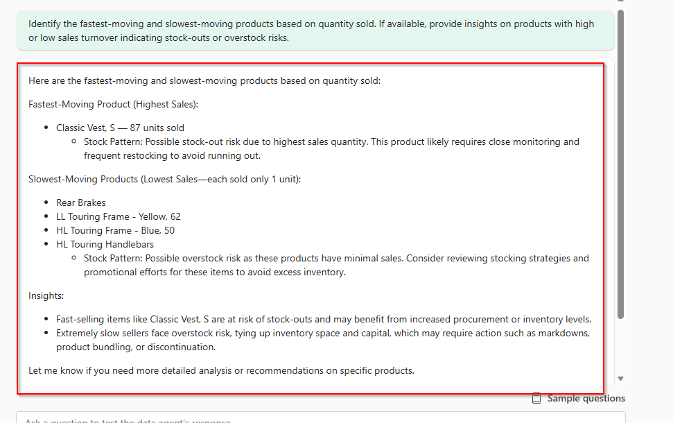

# Build a Data Agent using your SQL database

In this exercise, we use a **Data Agent** in **Microsoft Fabric** that is connected to a **SQL database** and grounded on a defined set of tables. Unlike Copilot, which is a general-purpose assistant designed to help users across a wide range of tasks and contexts, a Data Agent operates strictly within the data sources it is configured to access. The Data Agent answers questions only based on the **SQL tables** provided, ensuring responses are accurate, consistent, and governed by the underlying data. This approach demonstrates how AI can interact with structured data in a **controlled and reliable way, reflecting real-world enterprise scenarios** where trusted, data-backed insights are required.

## Section 1: Create Data Agent

### Task 1.1 
1. Select your workspace in Fabric.
   
 

2. Click on **'+ New item'**
 
 

4. In the filter serach for **Data Agent** and select Data agent.



4. Enter a unique name and click on **Create**.



### Task 1.2

1. Now that the Data Agent is ready, the next step is to connect it to the data. In the Explorer pane, select **Data**, click **Add data**, and then choose **Data source**.



2. Choose the SQL Database and click on **Add**




The Data Agent is ready. Now, select the following tables from the SalesLT schema:
   
-Product

-ProductCategory

-ProductDescription

-ProductModel

-SalesOrderDetail

3. You can also add Agent Instructions to guide how the data agent interprets questions and uses the selected tables when generating responses.

```
You are a data assistant for a product and sales analytics scenario.

Answer questions using only the data available in the SalesLT tables.
Base all responses strictly on the selected tables and their relationships.

Focus on:
- Products and product details
- Product categories and models
- Product descriptions
- Pricing and cost-related information
- Sales order and line-level sales details

When responding:
- Use clear, concise, and data-driven explanations
- Reference relevant tables and columns implicitly through your answers
- Do not infer, estimate, or fabricate values

If a question cannot be answered using the available data, clearly state that the information is not available in the current dataset.
Do not make assumptions or generate insights that are not supported by the database.

```



> **Note:** You can publish the **data agent** to your **Microsoft 365 account** so it can be used across your organization. In this workshop environment, publishing may be restricted due to licensing, but you will be able to do so once the appropriate license is available.

    
## Section 2: Test Data Agent
You may ask questions from the data agent:

```
Identify the fastest-moving and slowest-moving products based on quantity sold. If available, provide insights
on products with high or low sales turnover indicating stock-outs or overstock risks.

```



Review the response.

 > **Note:** The response from the data agent might not be exactly same.



Here are some more questions you may ask to the data agent.

```
1. Provide sales performance by product category, including total quantity sold and total sales revenue for each category.
2. What were the top selling products?
```
## What's next
Congratulations! In this exercise, you successfully created a Data Agent in Microsoft Fabric. You explored how a Data Agent functions within a defined data scope, providing responses strictly based on its underlying data. By asking business-focused questions—such as those about product performance and sales trends—you saw firsthand how Data Agents deliver trustworthy, data-driven insights rather than generic AI replies. This approach mirrors real-world enterprise needs, where governed, reliable, and repeatable AI interactions with structured data are crucial for informed decision-making. In the next exercise [Unlocking Onelake with Fabric SQL](../Module%2007%20-%20Integrate%20with%20%20Data%20Agents%2C%20Data%20Virtualization%20%26%20Power%20BI/02%20-%20Unlocking%20OneLake%20with%20Fabric%20SQL.md) you will explore Data virtualization in the Microsoft Fabric SQL Database allows you to query external data stored in OneLake using standard T-SQL without physically moving or copying the data.
