# Unlocking OneLake with Fabric SQL Data Virtualization

Data virtualization in the Microsoft Fabric SQL Database allows you to query external data stored in OneLake using standard T-SQL without physically moving or copying the data.


This guide walks through the end-to-end process of:

•	Uploading parquet/csv files to a Fabric Lakehouse.

•	Creating external data sources, file formats, and external tables using T-SQL.

•	Querying external data with **OPENROWSET**.

•	Building a Power BI report from the SQL Database using Copilot.


>**Note**: Only Fabric Lakehouse is natively supported. However, OneLake Shortcuts can extend connectivity to Azure Blob Storage, Azure Data Lake Gen2, Dataverse, Amazon S3, Amazon S3-Compatible, Google Cloud Storage, public HTTPS, and more.

## Section 1: Preparing Your Data in the Lakehouse**

### Task 1.1:
1. Navigate back to your **Microsoft Fabric** workspace.


   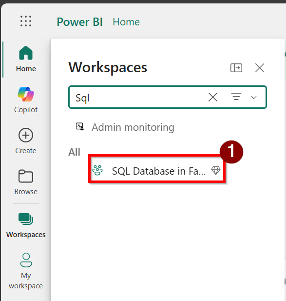
   
2. Select **+ New** item.
3. In the **search box** on the right, type **Lakehouse** and select **Lakehouse** from the results.
   
   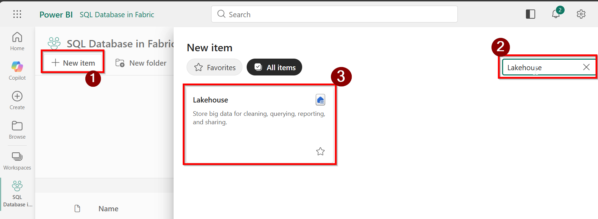
   
4. Provide a **name** for the **Lakehouse** and select **Create**.

 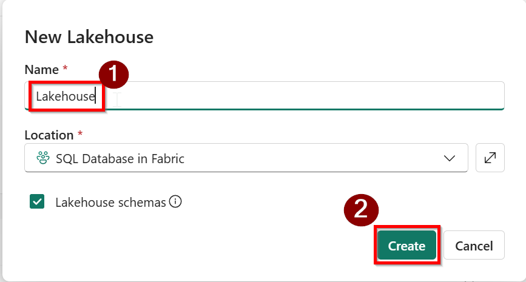

> **Note:** Please download **parquet files** from here.
> **[`Customer.parquet`](https://github.com/sukkaur/SQLConSQLdbinFabricWorkshop/blob/main/artifacts/Customer.parquet)**
> **[`SalesOrder.parquet`](https://github.com/sukkaur/SQLConSQLdbinFabricWorkshop/blob/main/artifacts/SalesOrder.parquet)**

### Task 1.2
1. In your **Lakehouse** select **Files** from the left pane, Select the three dots **(⋯)** menu and choose **Upload → Upload files**.
   
  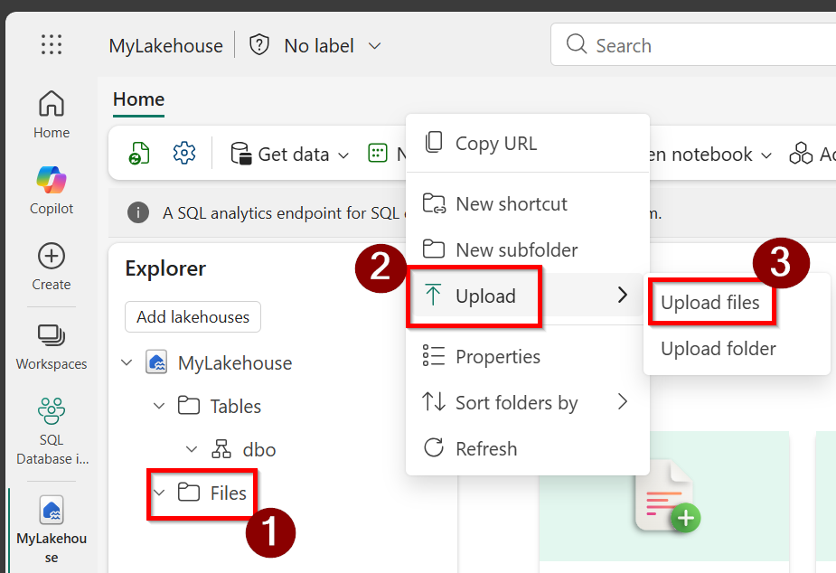

2. Upload the **Parquet files** from your **local machine** that you downloaded earlier.
   
     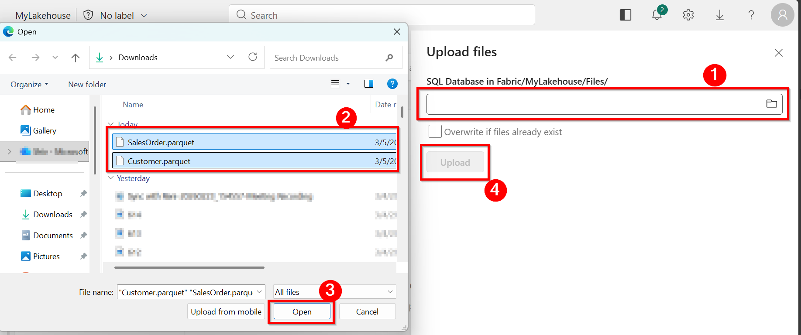
 
3. After the upload completes, the files will appear under the Files section of the **Lakehouse**, as shown below.
    
    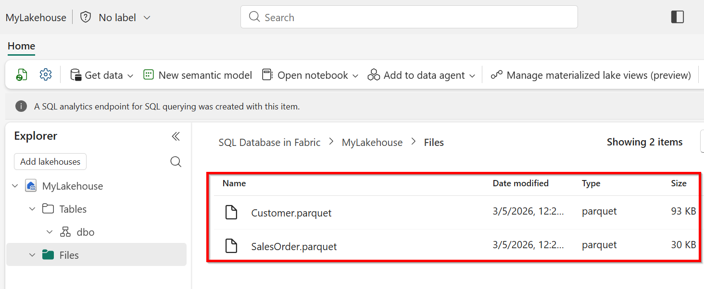

4. Click the ellipsis **(…)** menu and select **Properties**.
    
    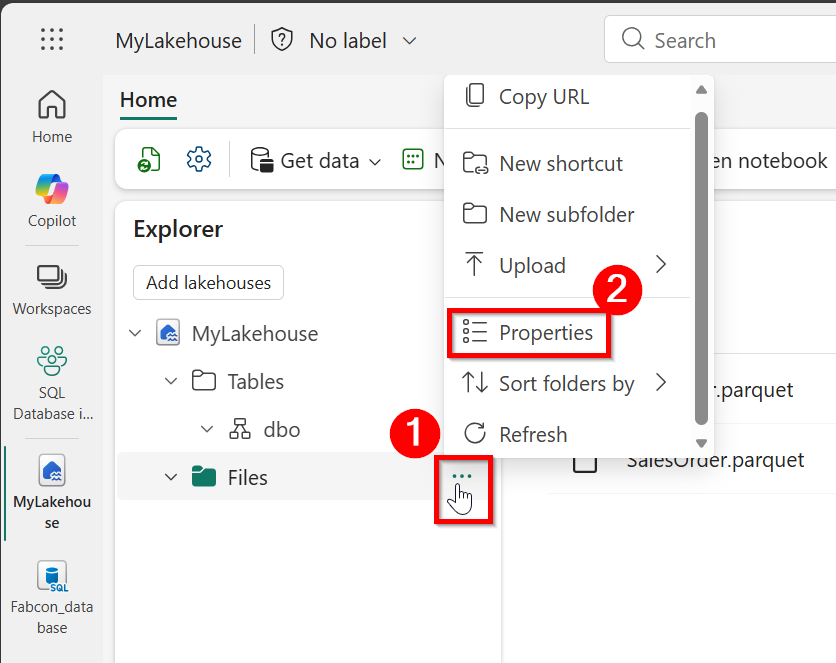
   
5. **Scroll down** and Copy the **ABFS** path shown in the Properties pane.

    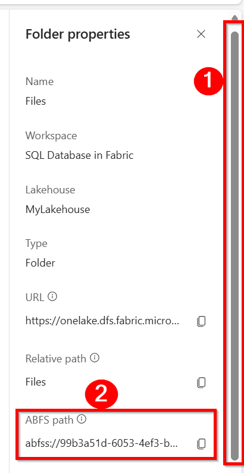

> **Note**: Open a notepad file and paste the **ABFS Path** url, you will need it later.

### Task 1.3: Querying External Data with T-SQL

1. Navigate back to your **Fabric SQL Database** and Open a **New SQL Query**.
   
    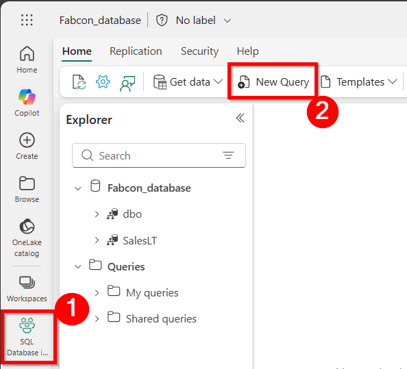
   
2. Paste the code below into the **SQL editor** and replace the **ABFS_Path** values.
   


```SQL
SELECT * FROM OPENROWSET (BULK 'ABFS_Path/Customer.parquet', 
     FORMAT = 'parquet') 
     AS customer_dataset; 
```


 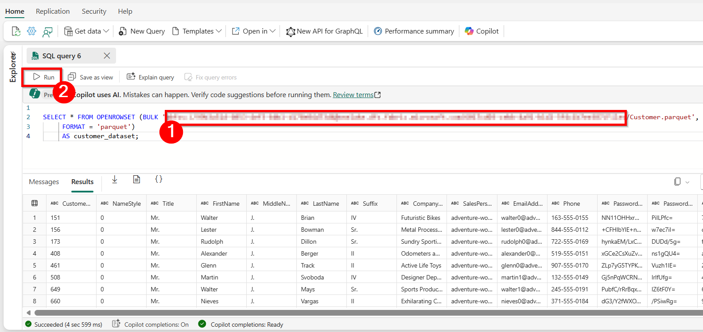

3. Click on run to view data from external data sourec.

 

## Section 2: Setting Up External Tables
To create an external table, SQL needs a few supporting objects that describe where the data lives and how it should be read. External tables offer a reusable and structured way to query data stored outside the database. Specifically, you must define an External Data Source to point to the external location, and an External File Format to tell SQL how to interpret the data.

### Task 2.1
1. Open a **New SQL Query** and Paste the code below into the **SQL editor** , replace the **ABFS_Path** value as needed (the one you copied from Task 1.2 Step 5), and then click **Run**.

```SQL
-- Creating External Data Source
CREATE EXTERNAL DATA SOURCE [Cold_Lake]
WITH (
    LOCATION = 'abfss://<workspace_ID>@<tenant>.dfs.fabric.microsoft.com/<lakehouse_ID>/Files/'
);

-- Creating External File Format for Parquet
CREATE EXTERNAL FILE FORMAT ParquetFF
WITH (FORMAT_TYPE = PARQUET);

```

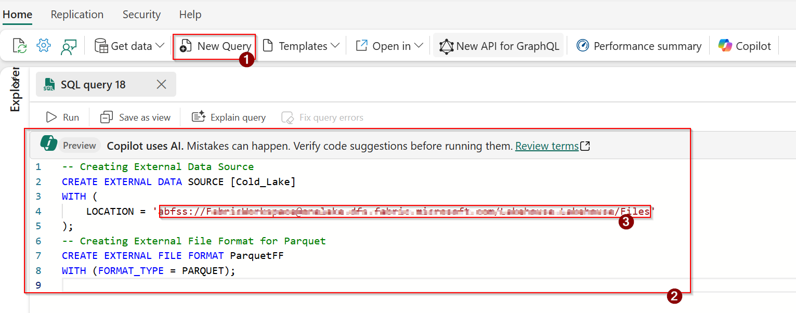

2. Click on **New SQL Query** and paste code below into the **SQL editor**, and click **Run**.

 

```SQL
-- Creating External Table under SalesLT schema
CREATE EXTERNAL TABLE SalesLT.ext_customer (
    CustomerID      INT,
    NameStyle       INT,
    Title           VARCHAR(10),
    FirstName      VARCHAR(100),
    MiddleName      NVARCHAR(100),
    LastName        VARCHAR(100),
    Suffix          VARCHAR(10),
    CompanyName     VARCHAR(256),
    SalesPerson     VARCHAR(100),
    EmailAddress    VARCHAR(256),
    Phone           VARCHAR(50),
    PasswordHash    NCHAR(256),
    rowguid         NVARCHAR(100),
    ModifiedDate    VARCHAR(100)
)
WITH (
    LOCATION = '/Customer.parquet',  -- File path relative to data source
    DATA_SOURCE = Cold_Lake,
    FILE_FORMAT = ParquetFF
);

---------------------
CREATE EXTERNAL TABLE SalesLT.ext_salesorder (
    SalesOrderID Int,
    SalesOrderDetailID Int,
    OrderQty Int,
    ProductID Int,
    UnitPrice FLOAT,
    UnitPriceDiscount FLOAT,
    rowguid NVARCHAR (1000),
    ModifiedDate NVARCHAR (1000)
)
  WITH (
    LOCATION = '/SalesOrder.parquet',  -- File path relative to data source
    DATA_SOURCE = Cold_Lake,
    FILE_FORMAT = ParquetFF
);

```
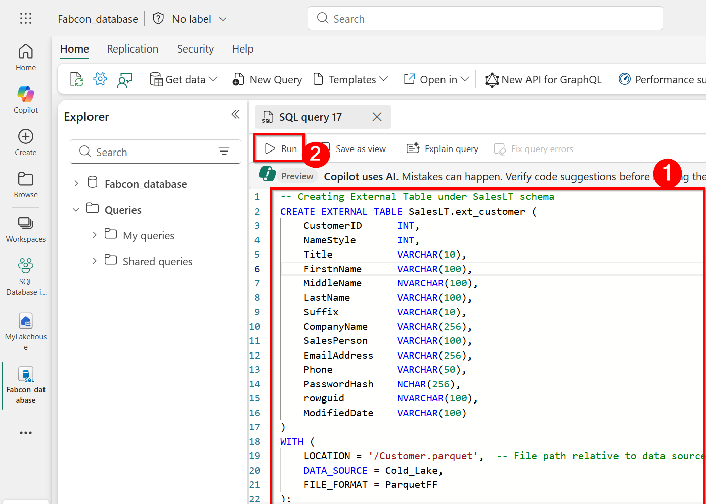
3. To view the created external table, expand **SQL DB Explorer**, select the database, expand the **SalesLT** schema, then expand **External Tables** and select the table.

 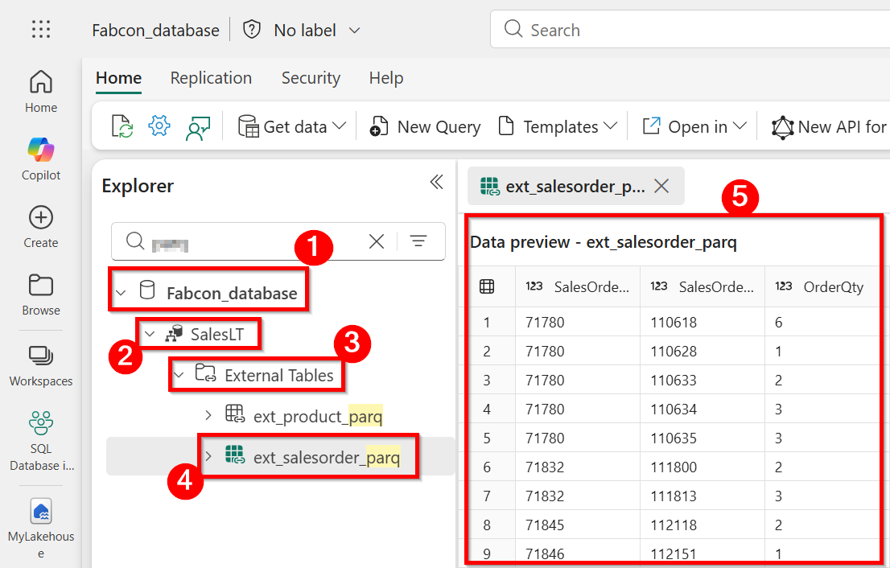

4. Alternatively, you can run the **SQL code** below to view the **external table** directly in your SQL database.

 
```SQL
SELECT * FROM sys.external_tables


```
 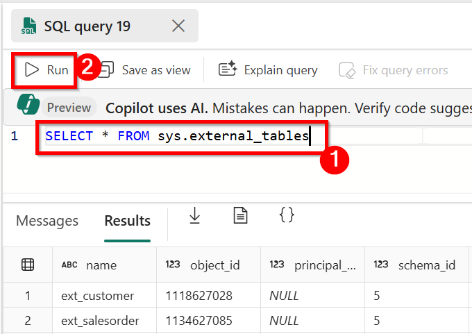
 

## What's next
In this exercise, you leveraged **OPENROWSET** to virtualize external data in a SQL database within **Microsoft Fabric** by querying data stored in **OneLake** directly using **T‑SQL**. This approach enables seamless access to external files—such as **Parquet** and **CSV** —without requiring data ingestion or physical movement into the SQL database.
By using data virtualization capabilities, the SQL database can execute **read‑only queries** against data in its original location and format. This allows external data to be combined with relational tables using familiar SQL constructs, simplifying data access patterns while reducing data duplication and eliminating the overhead of traditional ETL processes.
The exercise demonstrated how **OPENROWSET** serves as a flexible mechanism for **on‑demand querying** , making it well suited for exploratory analysis, reporting, and integration scenarios that require near real‑time access to data. Overall, this highlights how **Microsoft Fabric** enables unified analytics by connecting SQL databases and OneLake through data virtualization, delivering efficient, scalable, and governance‑friendly data access without compromising performance or manageability.
In the next exercise [Power BI Report with Copilot](../Module%2007%20-%20Integrate%20with%20%20Data%20Agents%2C%20Data%20Virtualization%20%26%20Power%20BI/03%20-%20Power%20BI%20Report%20with%20Copilot.md) , you will create semantic model and a Report from the fabric workspace.


