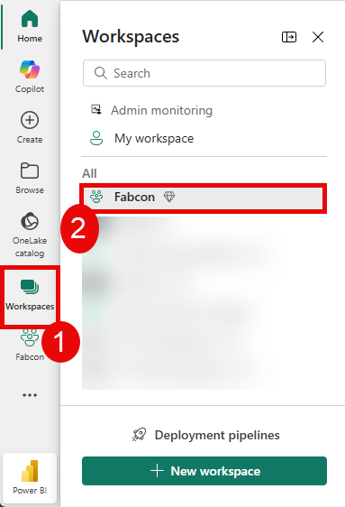
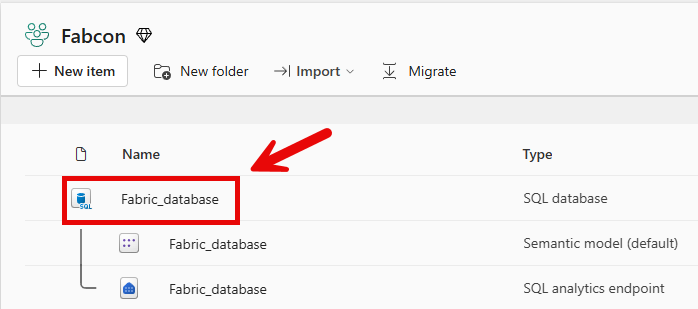
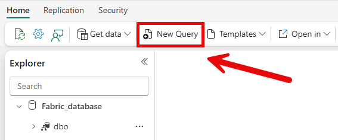
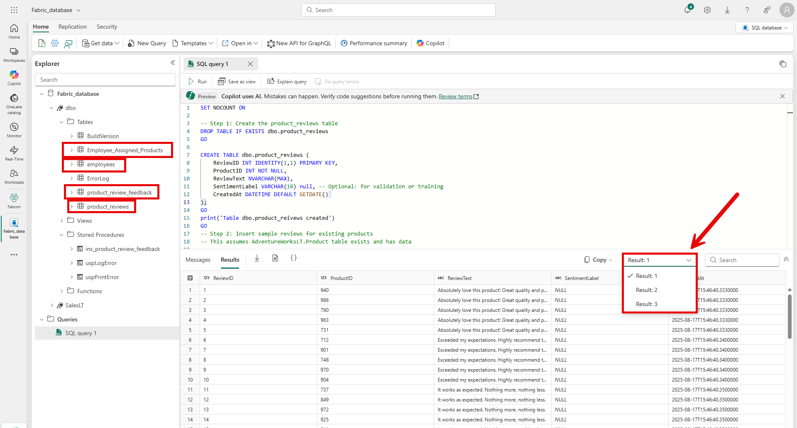
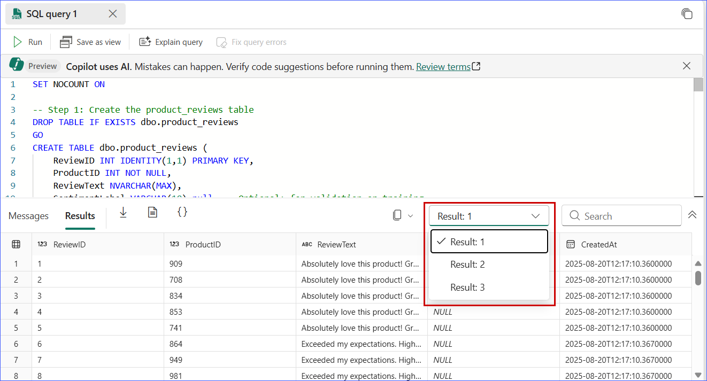
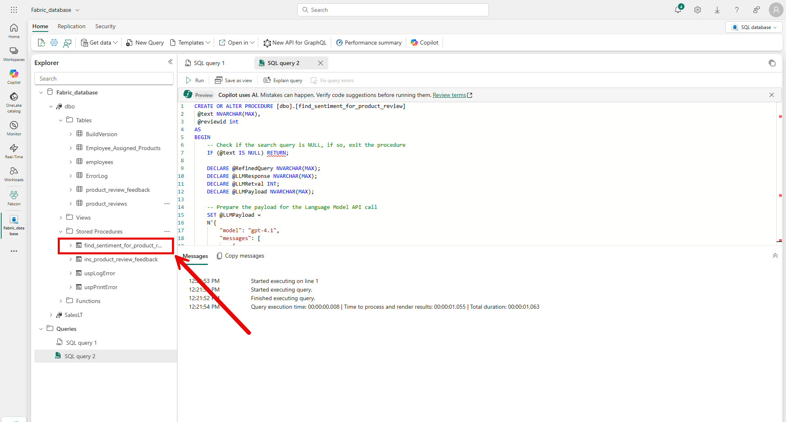
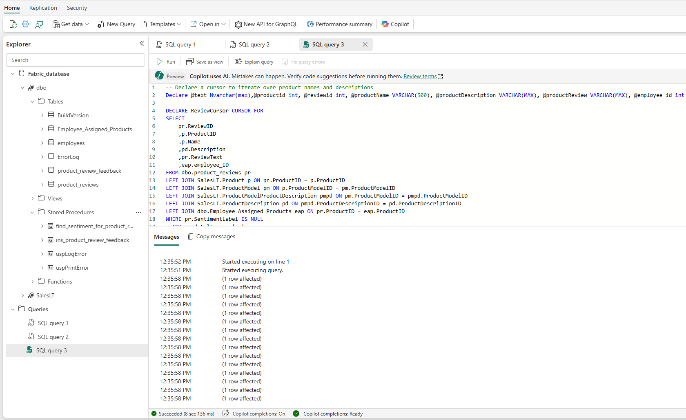
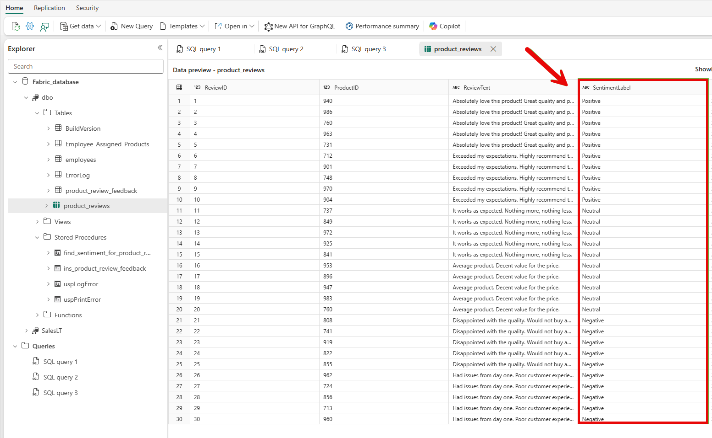
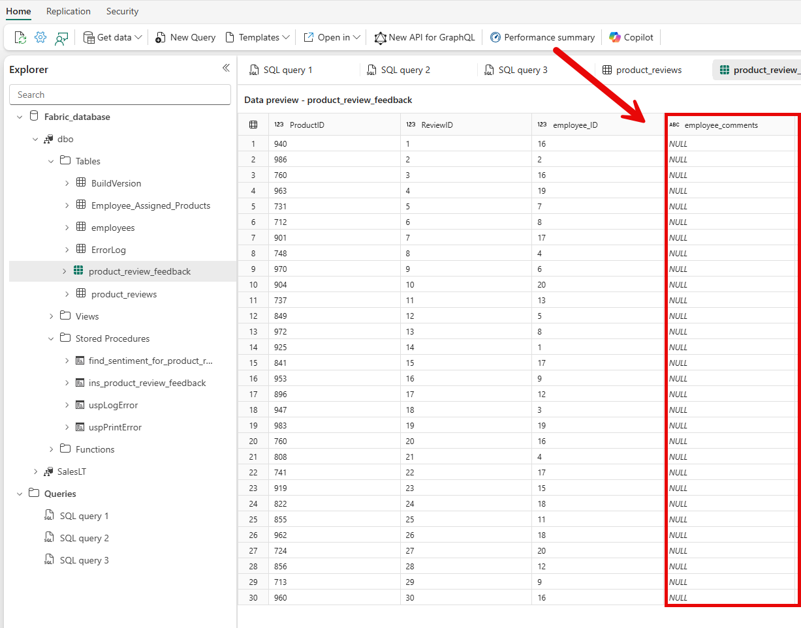

# Sentiment Analysis with Power BI & Translytical Taskflows

In this exercise you will build on the examples from the previous exercise to **score for sentiment** user reviews of products for AdventureWorks.  You will then use Translytical Taskflows to create a **user data function**,**embed it within a Power BI report**, and **respond to the reviews** in order to determine if any actions or follow up is needed by you, the AdventureWorks employee, who owns the product.

We will start by **Data Population for Sentiment Analysis**

## Section 1: Set up tables needed for Product Review.

### Task 1.1 :  Adding Product Review, Product Owners, and Employees tables with data.
1. Click on **Workspaces** from the left navigation pane and select the **Fabcon** workspace.

	

2. Search for **database** and select the database created in the previous task.

	

3. Click on the **New Query** icon.

	

4. Copy & paste the following query, click on the **Run** icon and then check the output. 

```SQL
SET NOCOUNT ON

-- Step 1: Create the product_reviews table
DROP TABLE IF EXISTS dbo.product_reviews
GO
CREATE TABLE dbo.product_reviews (
    ReviewID INT IDENTITY(1,1) PRIMARY KEY,
    ProductID INT NOT NULL,
    ReviewText NVARCHAR(MAX),
    SentimentLabel VARCHAR(10) null, -- Optional: for validation or training
    CreatedAt DATETIME DEFAULT GETDATE()
);
GO
print('Table dbo.product_reivews created')
GO

-- Step 2: Insert sample reviews for existing products
-- This assumes AdventureWorksLT.Product table exists and has data

-- Positive Reviews
INSERT INTO dbo.product_reviews (ProductID, ReviewText)
SELECT TOP 5 ProductID,
    'Absolutely love this product! Great quality and performance.'
FROM SalesLT.Product
ORDER BY NEWID();

INSERT INTO dbo.product_reviews (ProductID, ReviewText)
SELECT TOP 5 ProductID,
    'Exceeded my expectations. Highly recommend to others!'
FROM SalesLT.Product
ORDER BY NEWID();

-- Neutral Reviews
INSERT INTO dbo.product_reviews (ProductID, ReviewText)
SELECT TOP 5 ProductID,
    'It works as expected. Nothing more, nothing less.'
FROM SalesLT.Product
ORDER BY NEWID();

INSERT INTO dbo.product_reviews (ProductID, ReviewText)
SELECT TOP 5 ProductID,
    'Average product. Decent value for the price.'
FROM SalesLT.Product
ORDER BY NEWID();

-- Negative Reviews
INSERT INTO dbo.product_reviews (ProductID, ReviewText)
SELECT TOP 5 ProductID,
    'Disappointed with the quality. Would not buy again.'
FROM SalesLT.Product
ORDER BY NEWID();

INSERT INTO dbo.product_reviews (ProductID, ReviewText)
SELECT TOP 5 ProductID,
    'Had issues from day one. Poor customer experience.'
FROM SalesLT.Product
ORDER BY NEWID();
GO
print('Table dbo.product_reivews populated with positive, negative, and nuetral reviews')

-- Step 3: Create the product_reviews table
DROP TABLE IF EXISTS dbo.employees
GO
CREATE TABLE dbo.employees(
	employee_ID int identity(1,1) primary key clustered,
    FirstName varchar(100) NULL,
	LastName varchar(100) NULL,
	JobTitle nvarchar(50) NOT NULL
) 
print('Table dbo.employees created')
GO
INSERT dbo.employees (FirstName, LastName, JobTitle) VALUES (N'Syed', N'Abbas', N'Pacific Sales Manager')
GO
INSERT dbo.employees (FirstName, LastName, JobTitle) VALUES (N'Kim', N'Abercrombie', N'Production Technician - WC60')
GO
INSERT dbo.employees (FirstName, LastName, JobTitle) VALUES (N'Hazem', N'Abolrous', N'Quality Assurance Manager')
GO
INSERT dbo.employees (FirstName, LastName, JobTitle) VALUES (N'Pilar', N'Ackerman', N'Shipping and Receiving Supervisor')
GO
INSERT dbo.employees (FirstName, LastName, JobTitle) VALUES (N'Jay', N'Adams', N'Production Technician - WC60')
GO
INSERT dbo.employees (FirstName, LastName, JobTitle) VALUES (N'François', N'Ajenstat', N'Database Administrator')
GO
INSERT dbo.employees (FirstName, LastName, JobTitle) VALUES (N'Amy', N'Alberts', N'European Sales Manager')
GO
INSERT dbo.employees (FirstName, LastName, JobTitle) VALUES (N'Greg', N'Alderson', N'Production Technician - WC45')
GO
INSERT dbo.employees (FirstName, LastName, JobTitle) VALUES (N'Sean', N'Alexander', N'Quality Assurance Technician')
GO
INSERT dbo.employees (FirstName, LastName, JobTitle) VALUES (N'Gary', N'Altman', N'Facilities Manager')
GO
INSERT dbo.employees (FirstName, LastName, JobTitle) VALUES (N'Nancy', N'Anderson', N'Production Technician - WC60')
GO
INSERT dbo.employees (FirstName, LastName, JobTitle) VALUES (N'Pamela', N'Ansman-Wolfe', N'Sales Representative')
GO
INSERT dbo.employees (FirstName, LastName, JobTitle) VALUES (N'Zainal', N'Arifin', N'Document Control Manager')
GO
INSERT dbo.employees (FirstName, LastName, JobTitle) VALUES (N'Dan', N'Bacon', N'Application Specialist')
GO
INSERT dbo.employees (FirstName, LastName, JobTitle) VALUES (N'Bryan', N'Baker', N'Production Technician - WC60')
GO
INSERT dbo.employees (FirstName, LastName, JobTitle) VALUES (N'Mary', N'Baker', N'Production Technician - WC10')
GO
INSERT dbo.employees (FirstName, LastName, JobTitle) VALUES (N'Angela', N'Barbariol', N'Production Technician - WC50')
GO
INSERT dbo.employees (FirstName, LastName, JobTitle) VALUES (N'David', N'Barber', N'Assistant to the Chief Financial Officer')
GO
INSERT dbo.employees (FirstName, LastName, JobTitle) VALUES (N'Paula', N'Barreto de Mattos', N'Human Resources Manager')
GO
INSERT dbo.employees (FirstName, LastName, JobTitle) VALUES (N'Wanida', N'Benshoof', N'Marketing Assistant')
GO
print('Table dbo.employees populated with data')
GO

--4: Create the Employee_Assigned_Products table
IF OBJECT_ID('dbo.Employee_Assigned_Products', 'U') IS NOT NULL
    DROP TABLE dbo.Employee_Assigned_Products;
GO
CREATE TABLE dbo.Employee_Assigned_Products (
    Emp_Assigned_Pdct_ID INT IDENTITY(1,1) PRIMARY KEY CLUSTERED,
    employee_ID INT NOT NULL,
    ProductID INT NOT NULL
);
GO
print('Table dbo.Employee_Assigned_Products created')

--5: Populate the table using a round-robin assignment of employees to products
GO
Declare @SQL NVARCHAR(MAX)

SET @SQL ='WITH EmployeeList AS (
    SELECT employee_ID, ROW_NUMBER() OVER (ORDER BY employee_ID) AS EmpRowNum
    FROM dbo.employees
),
ProductList AS (
    SELECT ProductID, ROW_NUMBER() OVER (ORDER BY ProductID) AS ProdRowNum
    FROM SalesLT.Product
),
Assignment AS (
    SELECT 
        p.ProductID,
        e.employee_ID
    FROM ProductList p
    JOIN EmployeeList e
        ON ((p.ProdRowNum - 1) % (SELECT COUNT(*) FROM EmployeeList)) + 1 = e.EmpRowNum
)
INSERT INTO dbo.Employee_Assigned_Products (employee_ID, ProductID)
SELECT employee_ID, ProductID
FROM Assignment'

exec sp_executesql @SQL
GO
print('Table dbo.Employee_Assigned_Products populated')
GO

--6: Create the product_review_feedback table
DROP TABLE IF EXISTS dbo.product_review_feedback
GO
CREATE TABLE dbo.product_review_feedback (
    ProductID INT NOT NULL,
    ReviewID INT NOT NULL,
    employee_ID INT NOT NULL,
    employee_comments VARCHAR(MAX),
    resolution VARCHAR(MAX),
    created_date DATETIME DEFAULT GETDATE(),
    updated_date DATETIME
);
GO
print('Table dbo.product_review_feedback created')
GO

--7: Create procedure to insert product_review_feedback
CREATE OR ALTER PROCEDURE [dbo].[ins_product_review_feedback]
 @ProductID int,
 @reviewid int,
 @employee_id int
AS
BEGIN
    INSERT INTO dbo.product_review_feedback(ProductID, ReviewID, employee_ID)
    values(@ProductID, @reviewid, @employee_id)
END;

GO
print('Procedure dbo.ins_product_review_feedback created')

--8: Examine the table outputs
SELECT * FROM dbo.product_reviews
SELECT * FROM dbo.employees
SELECT * FROM dbo.Employee_Assigned_Products

```

5. After the script is run under the dbo schema folder the tables **Employee_Assigned_Products**, **employees**, **product_review_feedback**, and **product_reviews** should be listed.  Under the Stored Procedures folder ins_product_review_feedback should be listed.

	> **Note:** Due to the dynamic nature of the script data populated in rows will vary from individual to individual and may not match the screen shot exactly.    

	


6. In the results pane Result 1 should list the rows from the **product_reviews** table, Result 2 should list the rows from the **employees table**, and Result 3 should list the results of dbo.**Employee_Assigned_Products**

	> **Note:** Due to the dynamic nature of the script data populated in rows will vary from individual to individual and may not match the screen shot exactly.      


	

### Task 1.2 : Create Stored Procedure to retrive product reviews.

1. Copy & paste the following query in the query editor and click on the **Run** icon and then check the output. 

> [!IMPORTANT]
>
> **Replace ``<your-api-endpoint>`` with your Open AI enpoint**

````SQL
CREATE OR ALTER PROCEDURE [dbo].[find_sentiment_for_product_review]
 @text NVARCHAR(MAX),
 @reviewid int
AS
BEGIN
    -- Check if the search query is NULL, if so, exit the procedure
    IF (@text IS NULL) RETURN;

    DECLARE @RefinedQuery NVARCHAR(MAX);
    DECLARE @LLMResponse NVARCHAR(MAX);
    DECLARE @LLMRetval INT;
    DECLARE @LLMPayload NVARCHAR(MAX);

    -- Prepare the payload for the Language Model API call
    SET @LLMPayload = 
    N'{
        "model": "gpt-4.1",
        "messages": [
            {
                "role": "system",
                "content": "You are an expert at scoring sentiment.  You will examine the product name, product description, and the customer review to determine sentiment.  Remember that the product name and product description can provide context to the review.  You will return one of these values, the review will be Positive, Neutral, or Negative."
            },
            {
                "role": "user",
                "content": "'+@text+'"
            }
        ],
        "max_completion_tokens": 800,
        "temperature": 1.0,
        "top_p": 1.0,
        "frequency_penalty": 0.0,
        "presence_penalty": 0.0,
        "model": "deployment"
    }';

    -- Call the external REST endpoint to interact with the Language Model
    EXEC @LLMRetval = sp_invoke_external_rest_endpoint
         @url = '<your-api-endpoint>/openai/deployments/gpt-4.1/chat/completions?api-version=2025-01-01-preview',
         @method = 'POST',
         @credential = [<your-api-endpoint>],
         @payload = @LLMPayload,
         @response = @LLMResponse OUTPUT;

    -- Extract the refined query from the LLM response JSON
    SET @RefinedQuery = JSON_VALUE(@LLMResponse, '$.result.choices[0].message.content');

    -- If the refined query is NULL or empty, use the original search query
    IF (@RefinedQuery IS NULL OR LEN(@RefinedQuery) = 0)
        begin
            SET @RefinedQuery = @text;
        end
    
    --Update Product Reviews with the Sentiment Score
    update dbo.product_reviews
    set SentimentLabel = @RefinedQuery
    where
        ReviewID=@reviewid

    --print 'refinedquery: ' + @RefinedQuery


END;


````
2. Validate that the **find_sentiment_for_product_review** stored procedure has been created.


	


	Notice in this stored procedure we are passing through the instructions to the AI Model.

````
"content": "You are an expert at scoring sentiment.  You will examine the product name, product description, and the customer review to determine sentiment.  Remember that the product name and product description can provide context to the review.  You will return one of these values, the review will be Positive, Neutral, or Negative."
````

The Product Description and the Product name could add context to a customer review.  For example, if the product were a lightweight bike and the customer review said "It was heavier than I expected", this could indicate Negative sentiment.  However, without the context of the product name and description it may come through as Nuetral sentiment.

## Task 1.3: Score existing customer reviews

1. Click on the **New Query** icon.


2. Copy/paste the below query in SQL query editor, click on the **Run** icon and then check the output. 


````SQL
-- Declare a cursor to iterate over product names and descriptions
Declare @text Nvarchar(max),@productid int, @reviewid int, @productName VARCHAR(500), @productDescription VARCHAR(MAX), @productReview VARCHAR(MAX), @employee_id int

DECLARE ReviewCursor CURSOR FOR
SELECT 
    pr.ReviewID
    ,p.ProductID
    ,p.Name
    ,pd.Description
    ,pr.ReviewText
    ,eap.employee_ID
FROM dbo.product_reviews pr
LEFT JOIN SalesLT.Product p ON pr.ProductID = p.ProductID
LEFT JOIN SalesLT.ProductModel pm ON p.ProductModelID = pm.ProductModelID
LEFT JOIN SalesLT.ProductModelProductDescription pmpd ON pm.ProductModelID = pmpd.ProductModelID
LEFT JOIN SalesLT.ProductDescription pd ON pmpd.ProductDescriptionID = pd.ProductDescriptionID
LEFT JOIN dbo.Employee_Assigned_Products eap ON pr.ProductID = eap.ProductID
WHERE pr.SentimentLabel IS NULL
  AND pmpd.Culture = 'en';

OPEN ReviewCursor;

FETCH NEXT FROM ReviewCursor INTO @reviewid, @productid, @productName, @productDescription,@productReview, @employee_id;

WHILE @@FETCH_STATUS = 0
BEGIN
    SET @productDescription = REPLACE(@productDescription, '"', '\"')


     -- set text value for sentiment analysis
     set @text= 'Product Name: '+'''' + @productName + '''' + ' Product Description: ' + '''' + @productDescription + '''' + ' Customer review: ' + '''' + @productReview + ''''
    
    -- execute procedure to call model and score sentiment
     EXEC dbo.find_sentiment_for_product_review @text, @reviewid

     --execute procedure to create product_review_feedback entry
     EXEC dbo.ins_product_review_feedback @productid, @reviewid, @employee_id 

      

    -- Fetch the next row
    FETCH NEXT FROM ReviewCursor INTO @reviewid, @productid, @productName, @productDescription,@productReview, @employee_id;
END;

CLOSE ReviewCursor;
DEALLOCATE ReviewCursor;

````

  


	After running this query the seniment column in the product_reviews table should no longer be null.  It should be scored with a sentiment by the model.

3. Click on the product_reviews table to validate the seniment data has been scored.

	> **Note:** Due to the dynamic nature of the script data populated in rows will vary from individual to individual and may not match the screen shot exactly.    

	

4. Click on the product_review_feedback table to validate that is has been populated with data.  The employee_comments column should currently be NULL.

	> **Note:** Due to the dynamic nature of the script data populated in rows will vary from individual to individual and may not match the screen shot exactly.    

	


## What's next
Congratulations! You have added the data needed for Sentimental Analysis. In the next module [Create Function](../Module%2008%20-%20Reporting%20with%20action%20using%20Translytical%20Taskflows%20in%20Power%20BI/02%20-%20Create%20Functions.md) you will explore how you can write functions to use in your PowerBI report.
