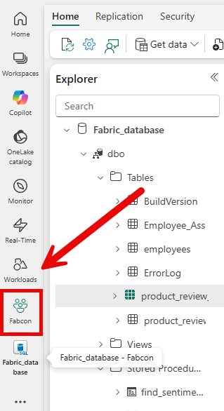
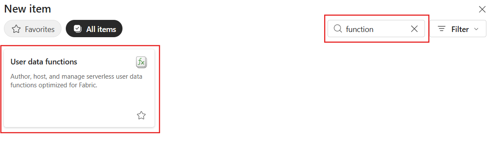
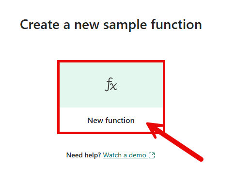
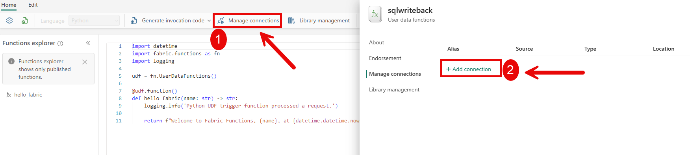
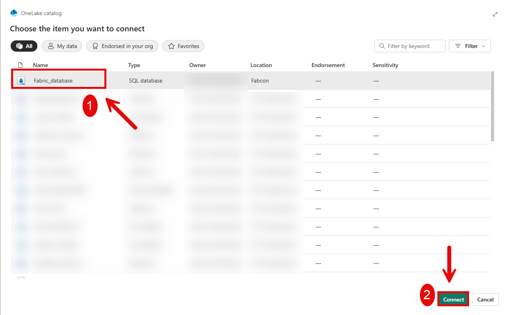
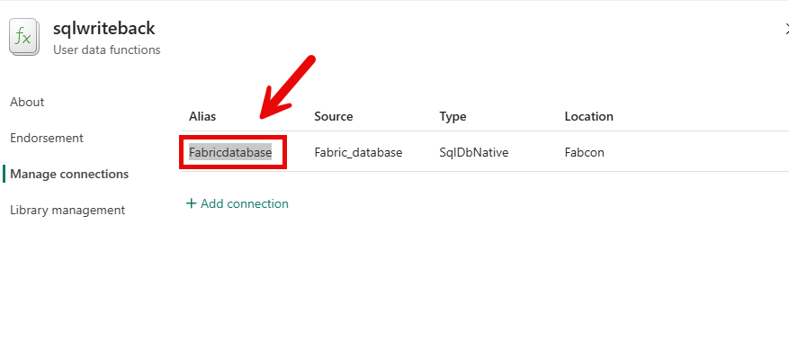
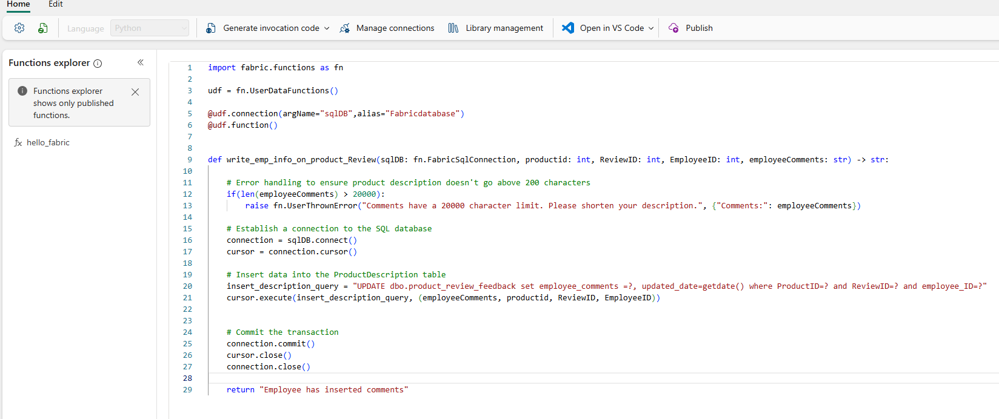
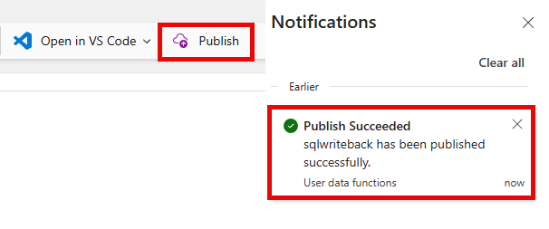

# User Data functions
User Data Functions in Microsoft Fabric provide a platform for developers to write and host custom logic that integrates seamlessly with Fabric's ecosystem. This feature supports Python 3.11.9 and allows the use of public libraries from PyPI, enabling developers to create reusable, customizable, and encapsulated functions for various data engineering tasks.

## Section 1: Create User Data Function sqlwriteback

### Task 1.1
1. Return to the main **Fabcon Workspace**.

   


2. Click **+ New item**, in the search box type **"function"**, and select **User data functions (preview)**.

   

3. Name the User data function **"sqlwriteback"**.


4. Click **New Function**.

   

5. Click **Manage connections** | **+Add connection**.

   

6. Click **Fabric_database** | click **Connect**.

   

Once the connection is established, the interface will appear as shown in the screenshot below. 

7. Copy the **Alias**, we will use that in a moment. Click the **Close** button.

   


8. Copy and paste the following code into the Function explorer window, replace the brackets and text in **[Put Alias Here]** with the Alias we copied in **step 7**.

   

````SQL
import fabric.functions as fn

udf = fn.UserDataFunctions()

@udf.connection(argName="sqlDB",alias="[Put Alias Here]") 
@udf.function() 


def write_emp_info_on_product_Review(sqlDB: fn.FabricSqlConnection, productid: int, ReviewID: int, EmployeeID: int, employeeComments: str) -> str:

    # Error handling to ensure product description doesn't go above 200 characters
    if(len(employeeComments) > 20000):
        raise fn.UserThrownError("Comments have a 20000 character limit. Please shorten your description.", {"Comments:": employeeComments})

    # Establish a connection to the SQL database  
    connection = sqlDB.connect() 
    cursor = connection.cursor() 

    # Insert data into the ProductDescription table
    insert_description_query = "UPDATE dbo.product_review_feedback set employee_comments =?, updated_date=getdate() where ProductID=? and ReviewID=? and employee_ID=?"   
    cursor.execute(insert_description_query, (employeeComments, productid, ReviewID, EmployeeID)) 


    # Commit the transaction 
    connection.commit() 
    cursor.close() 
    connection.close()  

    return "Employee has inserted comments"

````


9. Click **Publish**, it will take a moment for the User data function to publish, wait until you recieve the following notification **sqlwriteback has been published successfully.**

   > **Note:** Publishing the User data function may take a few minutes.  If it fails, attempt to Publish again.   

   


## What's next
Congratulations! You have created the function needed for your next exercise. In the next module [PowerBI Writeback](../Module%2008%20-%20Reporting%20with%20action%20using%20Translytical%20Taskflows%20in%20Power%20BI/03%20-%20PowerBIWriteback.md) you will explore how you use this function to super charge your report.
