# PowerBI Writeback


## Section 1: Download and Configure Power BI Report in Power BI Desktop
### Task 1.1: Download PowerBI template for use
**Right Click** and **open in another tab**; this link, [Sentiment by Product](../../artifacts/Sentiment%20by%20Product.pbix), to download the Power BI Report from the GitHub repository.

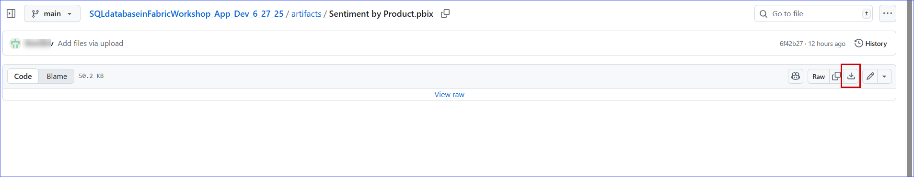

Open the Report from your Downloads folder and Sign into Power BI Desktop with the account you are using for the class.

> **Note:** If you get a prompt that data is being refreshed hit cancel.  If you do not hit cancel and it prompts you to log in, hit cancel, then hit cancel again.  Basically hit cancel until you can proceed with step 3 where we load the Server Name and Database Name parameters.      


## Section 2: Set up PowerBI template
### Task 2.1: 
1. Under **Home** click on **Transform data** dropdown,click on **Edit parameters**.

   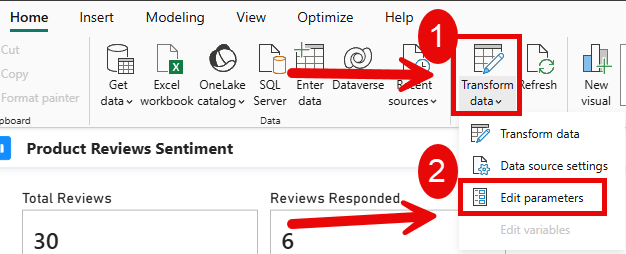

2. In your **Fabric Workspace** go to your **Fabcon_database** | Under **Home** click on Open in | Select **SQL Server Management Studio**.

   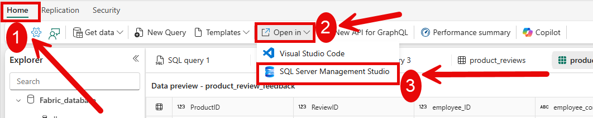

3. This will open a dialogue window | Copy the **Server Name** and the **Database Name** | Save it some where you can reuse it.

   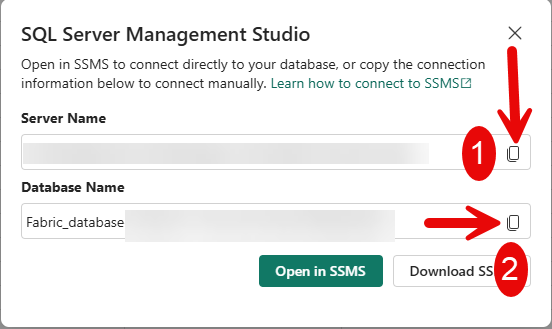

4. Back in Power BI Desktop **paste** the **Server Name** in the **Server Name** parameter and the **Database Name** in the **Database Name** parameter and **Click** OK.  

   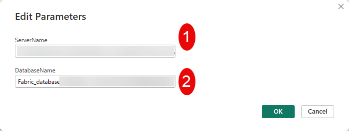


5. You may be promted to log into your Fabric Workspace using the credenitals that have been provided for this lab.  
   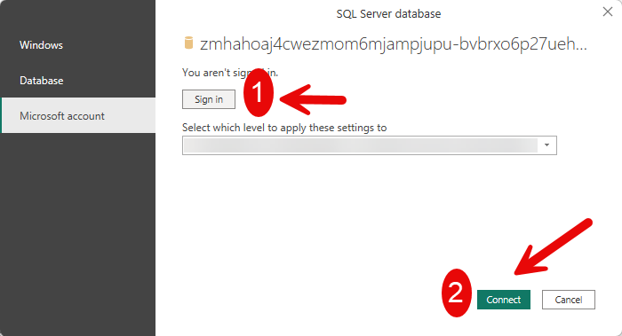

> **Note:** If you see a message that says "There are pending changes in your queries that haven't been applies", **click** Apply Changes. 

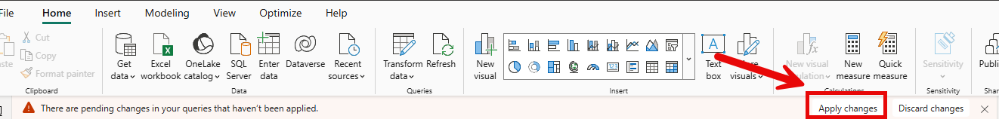

## Section 3
### Task 3.1 Update Submit button Action

**Click** on the **Employee Product Ownership** report Tab.

1. **select** on the Submit button.

   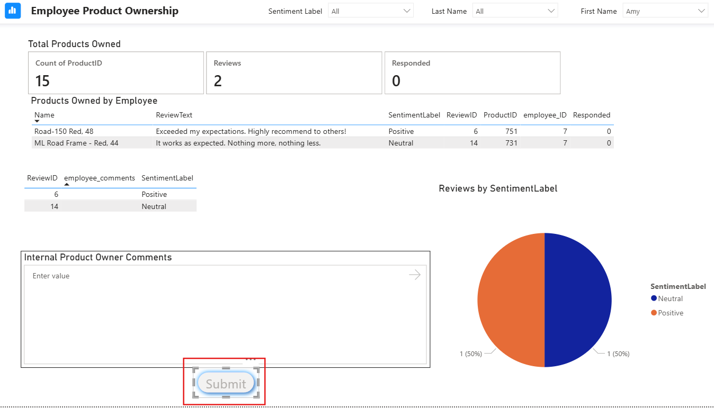

2. Under Format button expand the tree by Action.

   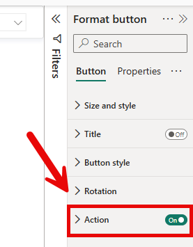

3. Under **Type** select **Data Function** | Under **Data functions** click **fx**.

   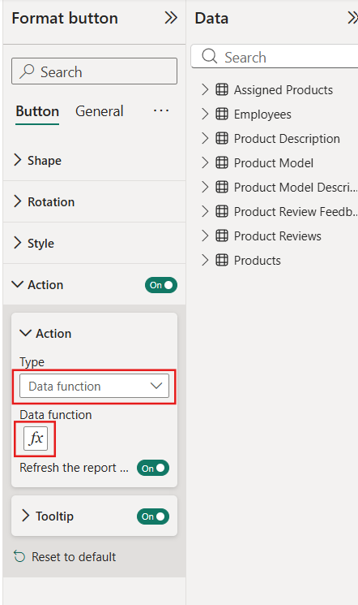

4. In the Onelake catalog you will see the list of functions e.g. **sqlwriteback** that you created in preview exercise. Expand **sqlwriteback** to see **write_emp_info_on_product_review**. Select **write_emp_info_on_product_review**. and click connect.

   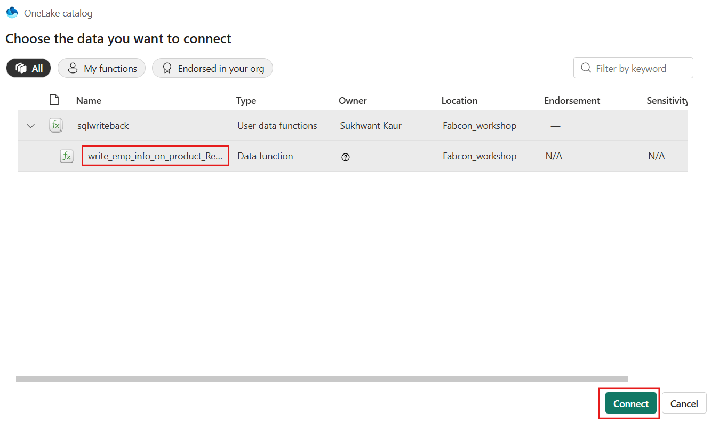

5. Select the **fx** button next to **productid**.

   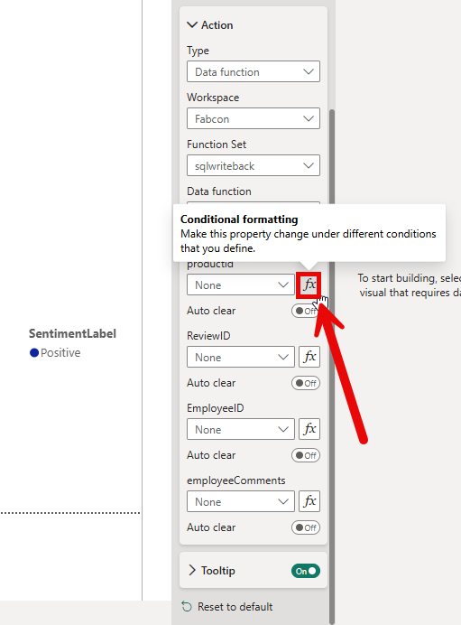

6. Under **What field should we base this on?**  Select **All data** | Select the **Products** table | Select **ProductID** | Under Summarization select **Maximum** | Click **OK**.

   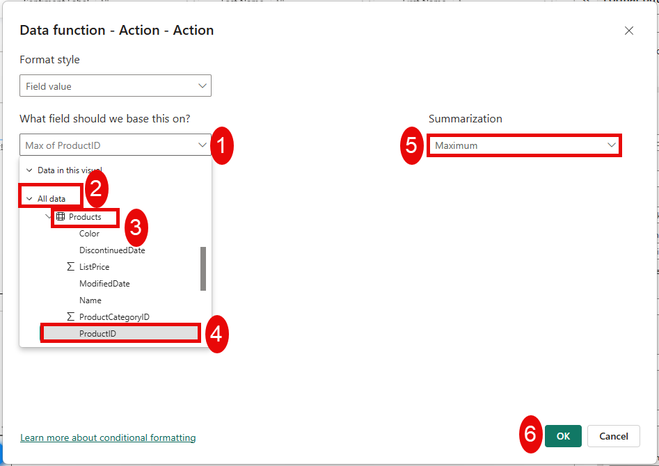

7. Repeat these steps for **ReviewID** Selecting the **Product Reviews** table under **All data**.

   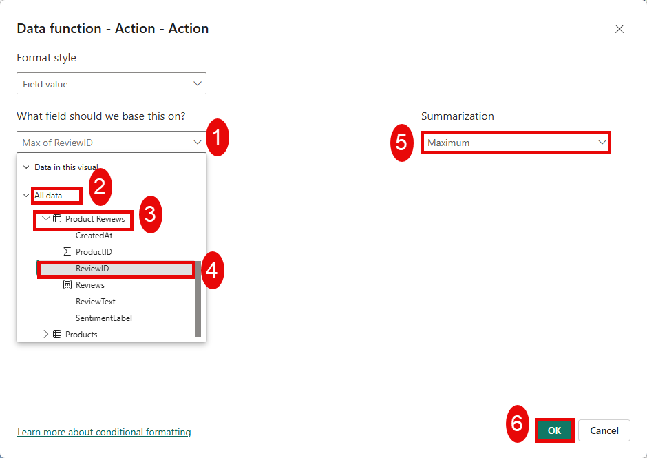

8. Repeat these steps for **EmployeeID** Selecting the **Employees** table under **All data** and the **employee_ID** column.

   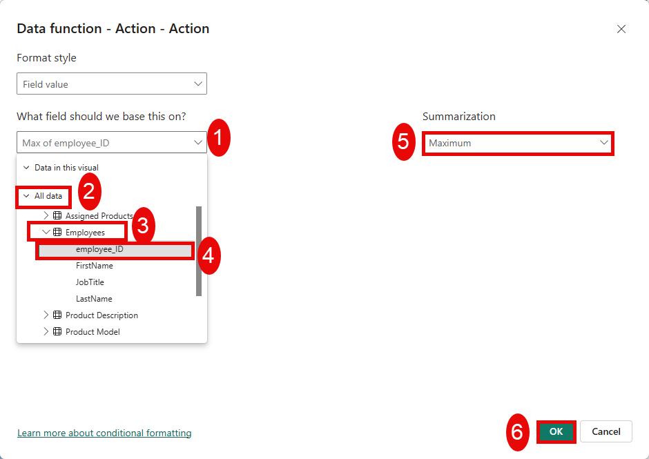

9. Select the drop down for **employeeComments** and select **Internal Product Owner Comments**. 

   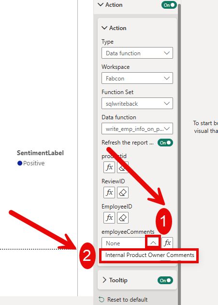

10. Click on **Home** | Click **Publish**.

    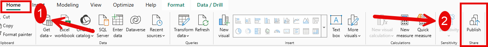

11. Click on your **Fabcon workspace** | Click **Select**.

    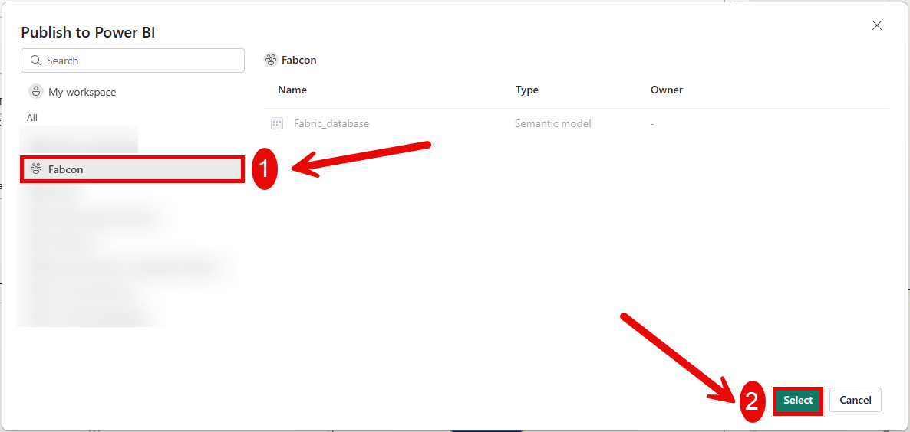

12. Click **Got it**.

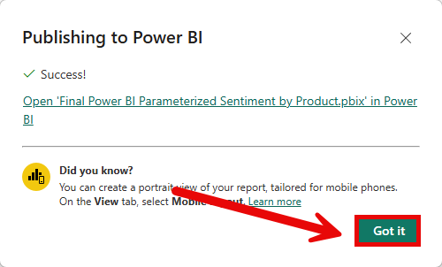

13. You may close Power BI Desktop now.


## Section 4: Upload Power BI Report and configure DirectQuery connections


1. Click on **Workspaces** from the left navigation pane and select the **Fabcon** workspace.


2. Click on the **Sentiment by Product** Semantic model.

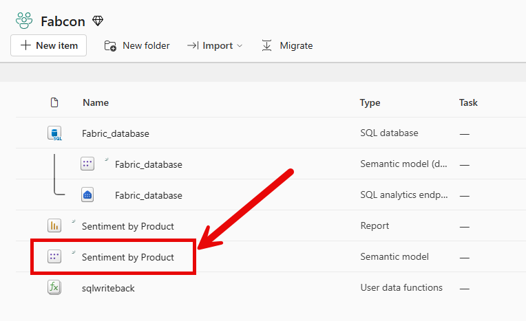


3. Click on  **File** | **Settings**.

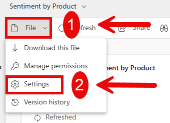


4. You will see an error that says **"Failed to test the connection to your data source.  Please retry your credentials."** |  Click **Edit credentials**.

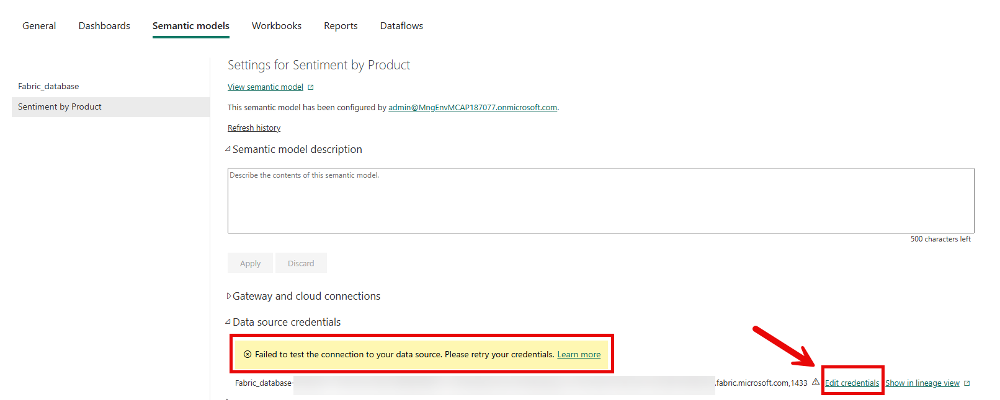


5. Select **OAuth2** for **Authentication Method** | Select **None** for **Privacy level setting for this dat asource** | **Check** Report viewers can access this data sourde with their own Power BI identities in  DirectQuery or DirectLake mode | Click **Sign in**.

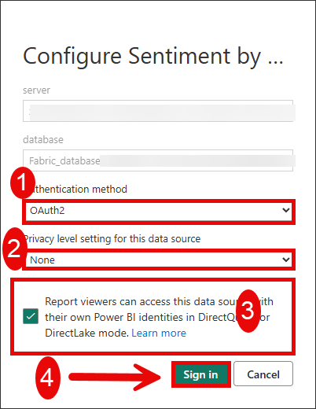


6. Click on **Workspaces** from the left navigation pane and select the **Fabcon** workspace.


7. Click on the Sentiment by Product report and validate that it loads correctly.

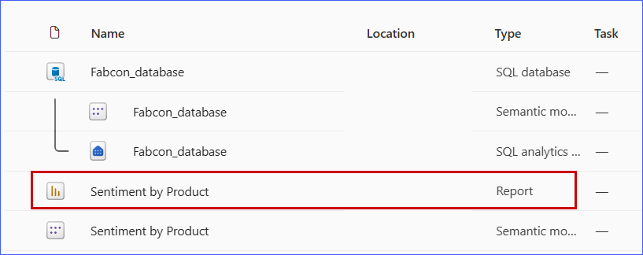


## Section 5: Find negative customer reviews and leave internal employee feedback

1. Click on your Fabric_database

2. Click on the **New Query** icon.

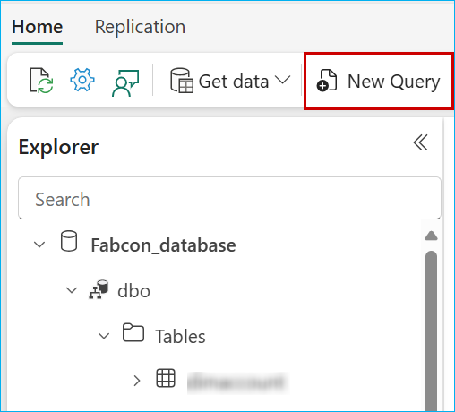

3. Copy and Paste the following query text and run it.

```SQL
SELECT 
    e.FirstName
    ,e.LastName
    ,pr.ReviewID
    ,pr.SentimentLabel
    ,p.ProductID
    ,p.Name
    ,pd.Description
    ,pr.ReviewText
    ,eap.employee_ID
FROM dbo.product_reviews pr
LEFT JOIN SalesLT.Product p ON pr.ProductID = p.ProductID
LEFT JOIN SalesLT.ProductModel pm ON p.ProductModelID = pm.ProductModelID
LEFT JOIN SalesLT.ProductModelProductDescription pmpd ON pm.ProductModelID = pmpd.ProductModelID
LEFT JOIN SalesLT.ProductDescription pd ON pmpd.ProductDescriptionID = pd.ProductDescriptionID
LEFT JOIN dbo.Employee_Assigned_Products eap ON pr.ProductID = eap.ProductID
LEFT JOIN dbo.employees e on eap.employee_ID = e.employee_ID
WHERE  pmpd.Culture = 'en'
and pr.SentimentLabel='Negative'
and pr.ReviewText='Had issues from day one. Poor customer experience.';

```


4. Select an Employee **First Name** and **Last Name** to use in the **Sentiment by Product report**.  For example in the picture FirstName David and LastName Barber is selected.  If David Barber is not the first name in your list, select the FirstName and LastName of the individual listed in the results of your query.

> **Note:** Due to the dynamic nature of the script data populated in rows will vary from individual to individual and may not match the screen shot exactly.      

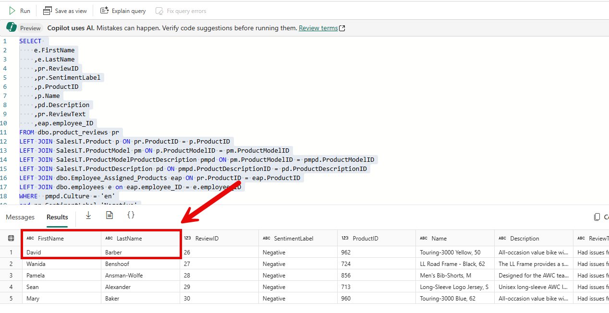

5. Click on the **Sentiment by Product** report on the left menu.

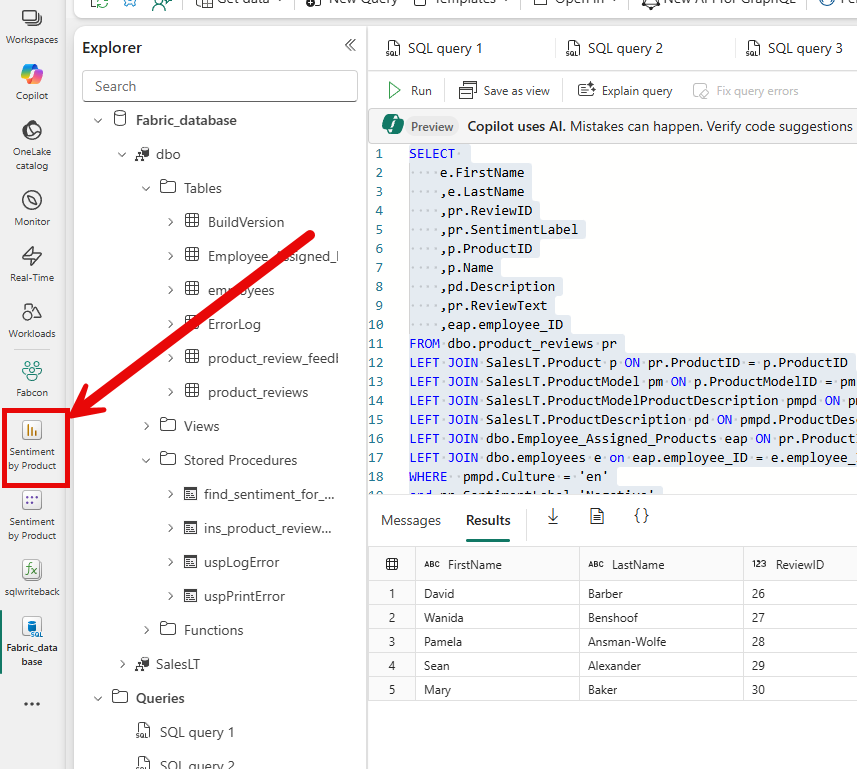


6. Click on the **Employee Product Ownership** tab | In the **filters** at the top select the employee **First Name** and **Last Name** from your **SQL query results** | Select one of the **products** from the **Products Owned by Employee** table that has the review that starts with **"Had issues from day one"**.

> **Note:** Due to the dynamic nature of the script data populated in rows will vary from individual to individual and may not match the screen shot exactly.      

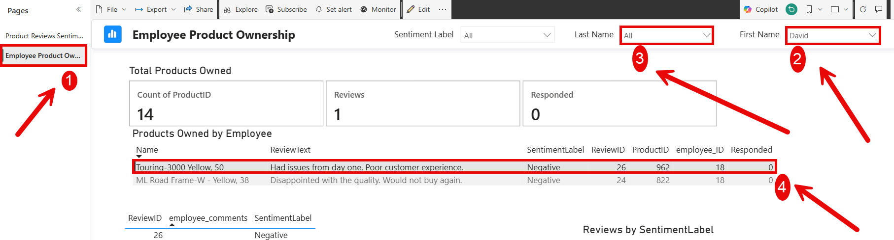


> **Note:** It is very important to select a line from the **Products Owned by Employee** table.  When you configured the action on our button you set all the fields to Maximum.  This captures the **Maximum** value selected on the page.  
You are selecting the **Maximum** values on the page by selecting one line on the Products Owned by Employee table.


7. Click on the text area titled **Internal Product Owner Comments**.  Enter a comment refering to the review for example: "This seems like it could be a sales, customer service, or some other type of issue.  We should loop in other managers and follow up with the customer to see where the problem is and what we can do to fix it." Click **Submit**.

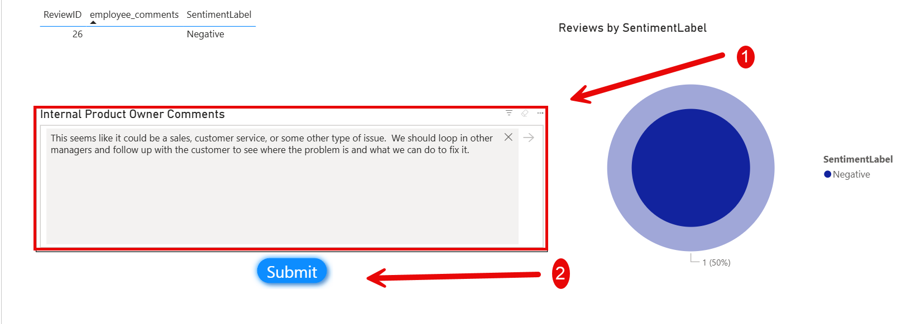

This will call our User data function and will enter our text into the dbo.product_review_feedback table.

9. You should see that the **Responded** title card now has **1 entry**, and the text we entered is not visible on the screen under the employee_comments table. 

> **Note:** Due to the dynamic nature of the script data populated in rows will vary from individual to individual and may not match the screen shot exactly.    

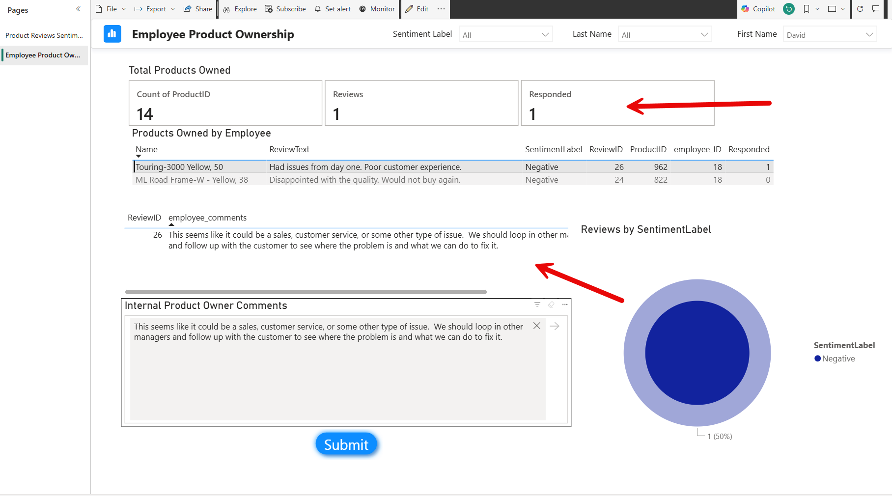


10. Click on the **Product Reviews Sentiment** tab | You will see **Reviews Responded** has incrmented and the Employee comments are now visible in the **Product Reviews Sentiment** table.

> **Note:** Due to the dynamic nature of the script data populated in rows will vary from individual to individual and may not match the screen shot exactly.    

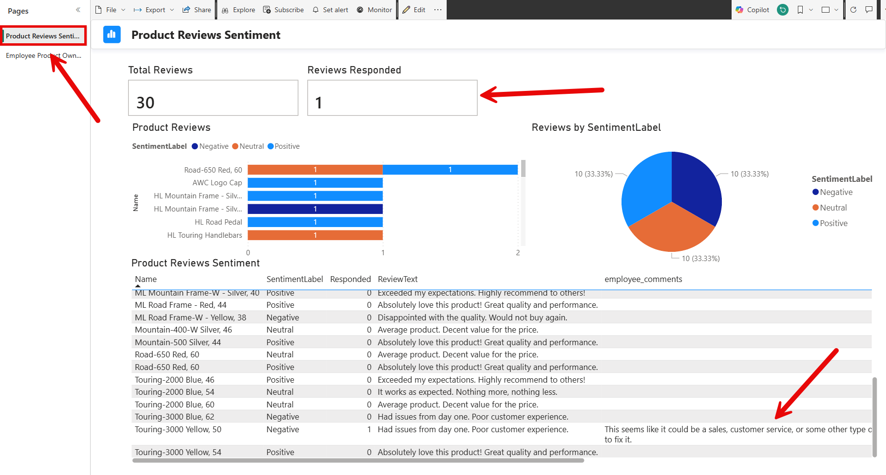

## What's next
Congratulations! You have learned how to leverage **Translytical Taskflows** to write back to SQL database directly from your Power BI Report. You are ready to move on to the next exercise: [Source control integration with Github](../Module%2009%20-%20Source%20control%20integration%20with%20Github/Github%20Source%20Control.md)
